# 算法分析

如何花更少时间和内存去完成任务。

对时间和空间两个维度去分析

## 算法的时间复杂度分析

1. 事后分析估算方法

测试程序

```java
public static void main(String[] args){
    long start = System.currentTimeMills();
    
    int sum = 0;
    int n = 100;
    for(int i = 1; i<= n; i++){
        sum += i;
    }
    system.out.Println("sum = " + sum);
    
    long end = System.currentTimeMills();
    System.out.Println(end - start);
}
```


2. 事前分析估算法：

* 算法采用的策略和方案；
* 编译产生的代码质量；
* 问题的输入规模；
* 机器执行指令的速度。

例子：计算1到100的和

```java
public static void main(String [] args){
    int sum = 0; //执行1次
    int n = 100; //执行1次
    for(int i = 1; i<=n; i++){//执行n+1次
        sum += i;//执行n次
    }
    System.out.Println("sum=" + sum);
}
```

```java
public static void main(String [] args){
    int sum = 0; //执行1次
    int n = 100; //执行1次
    sum = (n+1)*n/2;//执行1次
    System.out.Println("sum=" + sum);
}
```

第一个算法执行了`1+1+(n+1)+n = 2n+3` ， 第二种算法执行了`1+1+1=3`次 

**为什么循环判断在算法分析中可以被忽略呢？**

研究算法复杂度，侧重点是当输入规模不断增大时，算法的增长量的一个抽象规律，而不是精确的定位需要执行多少次。分析算法的运行时间，**最重要的就是把核心操作的次数和输入的规模关联起来。**

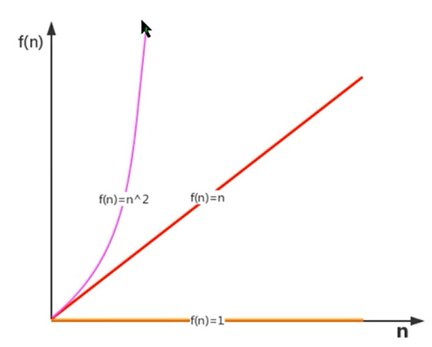

### 函数渐进增长

概念：给定两个函数`f(n)`和`g(n)`， 如果存在一个整数`N`, 使得对于所有的`n>N`，`f(n)`总是比`g(n)`大，则`f(n)`的增长渐进快于`g(n)`。

实用的结论：

**随着输入规模的增大，算法的常数操作可以忽略不记**

**随着输入规模的增大，与最高次项的常数因子可以忽略不记**

**最高次项的指数大的，随着n的增长，结果会变得增长得特别快**

**算法函数中n最高次幂越小，算法效率越高**


### 算法时间复杂度 大O表示法

执行次数=执行时间

规则：

* 用常数1取代运行时间中的所有加法常数
* 在修改后的运行次数中，只保留高阶项
* 如果最高阶项存在，且常数因子不为1，则去除与这个项相乘的常数

常见的大O阶

1. 线性阶

最常见于单层循环

2. 平方阶

一般嵌套循环属于平方阶

3. 立方阶

一般三层嵌套循环属于这个时间复杂度

4. 对数阶

5. 常数阶


### 函数调用的时间复杂度分析

```java
public static void main(String [] args){
    int n = 100;
    for(int i = 0; i < n; i++){
        show(i);
    }
    private static void show(int i){
        System.out.Println(i);
    }
}
```


在main()方法中，有一个for循环，循环体调用了show方法，show中执行了一次，则 O（n）


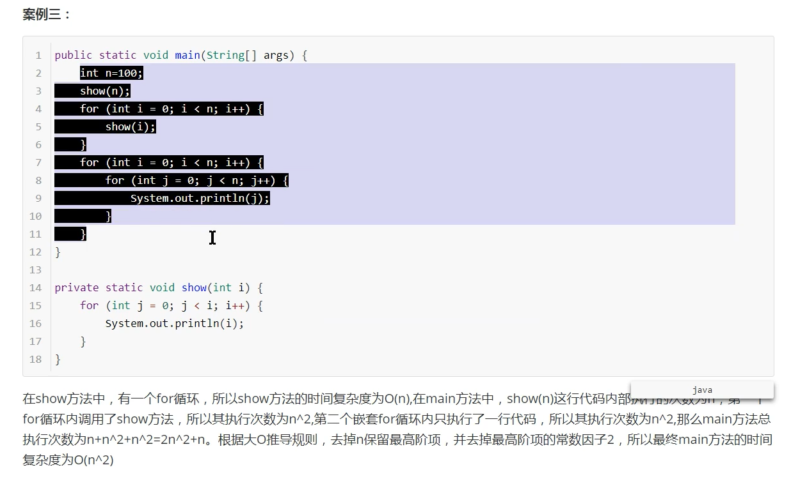

## 算法的空间复杂度分析

基本数据类型的内存占用：

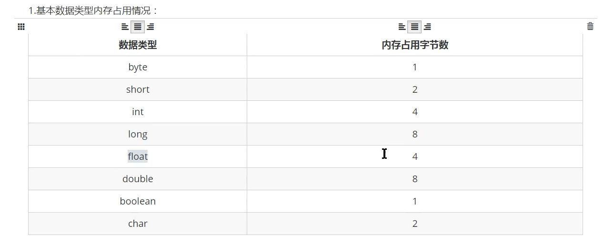

计算机访问内存的方式是每次一个字节

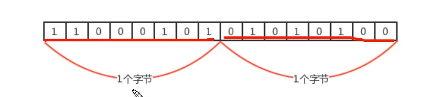

一个引用需要8个字节表示


一般内存使用，如果不够8个字节，都会被填充成8个字节 


# 排序算法

# 1. 简单排序

构造方法和成员方法 

## 1.1 冒泡排序(Bubble sort)

冒泡排序是一种简单的排序算法

**需求：**

排序前：{4，5，6，3，2，1}

排序后：{1，2，3，4，5，6}

**排序原理：**

1. 比较相邻的元素，如果前一个元素比后一个元素大，就交换这两个元素的位置。
2. 对每一对相邻元素做同样的工作，从开始第一对元素到结尾的最后一对元素，最终最后位置的元素就是最大值。

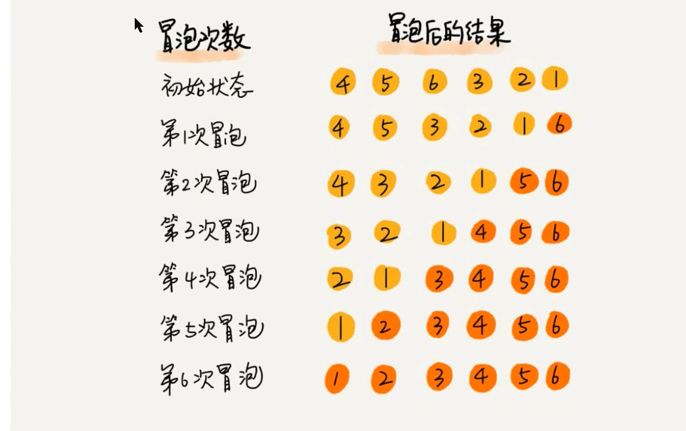

**冒泡排序API设计：**

| 类名     | Bubble                                                       |
| -------- | ------------------------------------------------------------ |
| 构造方法 | Bubble():创建Bubble对象                                      |
| 成员方法 | 1.public static void sort(Comparable[] a):对数组内的元素进行排序<br />2. private static boolean greater(Comparable v, Comparable w): 判断V是否大于W<br />3.private static void exch(Comparable[] a, int i, int j): 交换a数组中，索引i和索引j的值 |

**冒泡排序的代码实现：**

```java
//排序代码
public class Bubble{
    public static void sort(Comparable[] a){
        for(int i = a.lenght-1; i>0;i--){
            for(int j = 0; j < i; j++){
                if(greater(a[j], a[j+1])){
                    exch(a, j, j+1)
                }
            }
        }
    }
    private static boolean greater(Comparable v, comparable w){
    	return v.compareTo(w)>0;
      }
    private static void exch(Comparable[] a, int i, int j){
        Comparable temp;
        temp = a[i];
        a[i] = a[j];
        a[j] = temp;
    }
}
```

**冒泡排序的C++代码实现**

```c++
#include <iostream>
#include <vector>
using namespace std;

void swap(std::vector<int> &a, int i, int j){
    int t = a[i];
    a[i] = a[j];
    a[j] = t;
}


void bubble_sort(std::vector<int> &a){
    int len = a.size();
    for(int i = len -1; i>0; i--){
        for(int j = 0; j<i;j++){
            if(a[j+1] < a[j]){
                swap(a, j, j+1);
            }
        }
    }
}


int main(int argc, char** argv){
    vector<int> a = {6,5,4,3,2,1};
    bubble_sort(a);
    cout<< "the sequence for the bubble sort:"<<endl;
    for(int i=0; i<a.size();i++){
        cout<<a.at(i)<<" ";
    }
    return 0;
}
```

**冒泡排序的时间复杂度分析**

在最坏情况下：{6，5，4，3，2，1}：

元素的比较次数：

`(N-1)+(N-2)+(N-3)+...+2+1 = N^2/2-N/2`

元素的交换次数:

`(N-1)+(N-2)+(N-3)+...+2+1 = N^2/2-N/2`

总执行次数：

`(n^2/2-n/2)+(n^2/2-n/2) = n^2-n`

时间复杂度为：`O(N^2)`


## 1.2 选择排序

需求：

排序前：{4，6，8，7，9，2，10，1}

排序后：{1，2，4，5，7，8，9，10}

**排序原理**

1. 每一次遍历的过程中， 都假定第一个索引处的元素是最小值，和其他索引处的值依次进行比较，如果当前索引处的值大于其他某个索引处的值，则假定其他某个索引出的值为最小值，最后可以找到最小值所在的索引
2. 交换第一个索引处和最小值所在的索引处的值

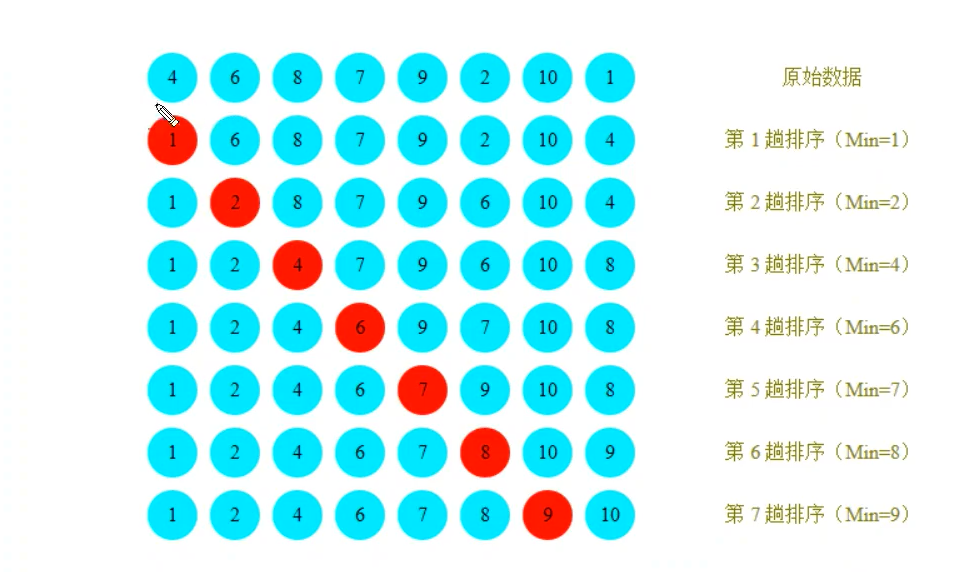

**选择排序API设计：**

|   类名   | Selection                                                    |
| :------: | ------------------------------------------------------------ |
| 构造方法 | Selection(): 创建Selection对象                               |
| 成员方法 | 1. public static void sort(Comparable[] a): 对数组内的元素进行排序<br />2. private static boolean greater(Comparable v, Comparable w): 判断v是否大于w<br />3. private static void exch(Comparable[] a, int i, int j):交换数组a中索引i和索引j处的值 |

**选择排序算法代码实现：**

```java
//排序代码
public class Selection{
    //对数组a中的元素进行排序
    public static void sort(Comparable[] a){
        for(int i = 0; i <= a.length -2; i++){
             //假定本次遍历，最小值所在的索引是i
        	int minIndex = i;
        	for(int j = i+1; j< a.length; j++){
                //比较最小索引处的值和minIndex的值
            	if(greater(a[minIndex], a[j])){
                	//更换最小值所在的索引
                	minIndex = j;
            	}
       		 }
           	//交换i索引处和minIndenx索引处的值
        	exch(a, i, minIndex);
     	}
        
    }
    private static boolean greater(Comparable v, Comparable w){
        return v.compareTo(w) > 0;
    }
    private staic void exch(Comparable[] a, int i, int j){
        Comparable temp;
        temp = a[i];
        a[i] = a[j];
        a[j] = temp;
    }
}
```

**选择排序的C++代码实现：**

```c++
#include <iostream>
#include <vector>

using namespace std;


void exch(std::vector<int> &a, int i, int j){
    int t = a[i];
    a[i] = a[j];
    a[j] = t;
}

void sort(std::vector<int> &a){
    for(int i = 0; i<= a.size()-2; i++){
        int minIndex = i;
        for(int j = i+1; j< a.size(); j++){
            if(a[minIndex] - a[j] > 0){
                minIndex = j;
            }
        }
        exch(a, i, minIndex);
    }
}


int main(int argc, char** argv){
    vector<int> a = {4,6,8,7,9,2,10,1};
    sort(a);
    cout<<"The sequence after the selection sort:"<<endl;
    for(int i=0; i<a.size();i++){
        cout<< a.at(i)<<" ";
    }
    return 0;
}
```

**选择排序的时间复杂度分析**

选择排序使用了双层for循环，其中外层循环完成了数据交换，内层循环完成了数据比较，所以我们分析数据交换次数和数据比较次数：

数据比较次数：

`(N-1)+(N-2)+...+2+1 = ((N-1)+1)*(N-1)/2=N^2/2-N/2;`

数据交换次数：

`(N-1)`

时间复杂度：

`N^2/2-N/2+(N-1)=N^2/2+N/2-1;`

时间复杂度为`O(N^2);`

### 

## 1.3 插入排序

插入排序（insertion sort）是一种简单直观且稳定的排序算法。

插入排序的工作方式非常像人们排序一手扑克牌一样。开始时，我们的左手为空并且桌子上的牌面朝下。然后，我们每次从桌上拿走一张牌并将它插入左手中正确的位置。为了找到一张牌的正确位置，我们从右到左将它与已经在手的牌进行比较。

需求：

排序前：{4，3，2，10，12，1，5，6}

排序后：{1，2，3，4，5，6，10，12}

**排序原理**

1. 把所有的元素分成两组，已经排序和未排序的
2. 找到未排序的组中的第一个元素，向已经排序的组中进行插入；
3. 倒叙遍历已经排序的元素，依次和待插入的元素进行比较，直到直到一个元素小于等于待插入排序元素，那么久把待插入元素放到这个位置，其他元素向后移动一位。

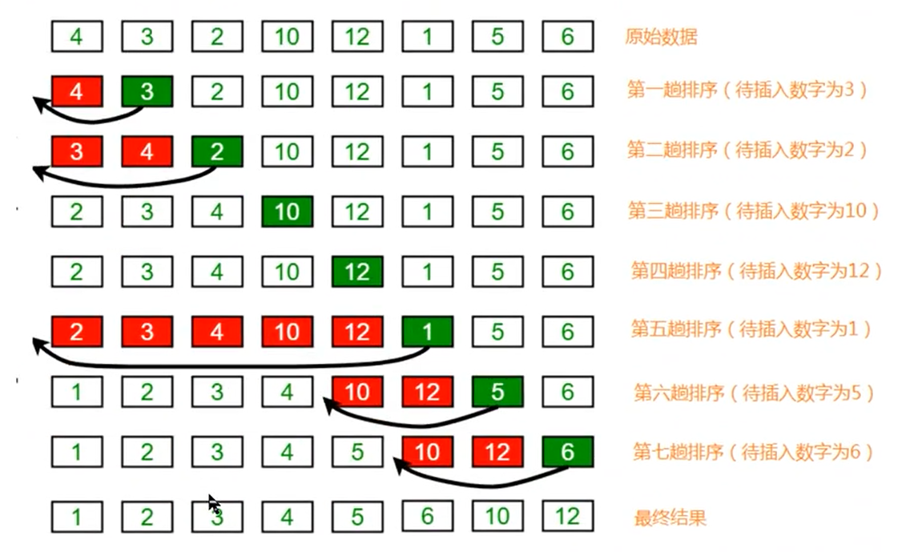


**插入排序API设计：**

| 类名     | Insertion                                                    |
| -------- | ------------------------------------------------------------ |
| 构造方法 | Insertion():创建Inertation对象                               |
| 成员方法 | 1.public static void sort(Comparable[] a):对数组内的元素进行排序<br />2. private static void boolean greater(Comparable v, Comparable w):判断v和w大小<br />3. private static void exch(Comparable[] a, int i, int j)：交换数组中索引i 和索引j 的值 |

**插入排序的实现**

```java
public class Insertion{
    public static void sort(Comparable[] a){
        for(int i= 1; i < a.lenght;i++){
            //当前元素为a[i],依次和i前面的元素比较，找到一个小于等于a[i]的元素
            for(int j = i; j>0; j--){
                //比较j 和j-1的值
                if(greater(a[j-1], a[j])){
                    //交换元素
                    exch(a, j-1, j);
                }
                else{
                    //找到元素
                    break;
                }
            }
        }
    }
    
    private static boolean greater(Comparable v, Comparable w){
        return v.compareTo(w) > 0;
    }
    
    private staic void exch(Comparable[] a, int i, int j){
        Comparable temp;
        temp = a[i];
        a[i] = a[j];
        a[j] = temp;
    }
    
}
```

**插入排序的C++代码实现：**

```c++
#include <iostream>
#include <vector>

using namespace std;

void exch(std::vector<int> &a, int i, int j)
{
    int temp = a[i];
    a[i] = a[j];
    a[j] = temp;
}

void insert_sort(std::vector<int> &a)
{
    for (int i = 1; i < a.size(); i++)
    {
        for (int j = i; j > 0; j--)
        {
            if (a[j - 1] - a[j] > 0)
            {
                exch(a, j - 1, j);
            }
            else
                break;
        }
    }
}

int main(int argc, char **argv)
{
    vector<int> a = {4, 6, 8, 7, 9, 2, 10, 1};
    insert_sort(a);
    cout << "The sequence after the insert sort:" << endl;
    for (int i = 0; i < a.size(); i++)
    {
        cout << a.at(i) << " ";
    }
    return 0;
}
```


**插入排序的时间复杂度分析**

插入排序使用了双层for循环，其中内层循环的循环体是真正完成排序的代码

比较次数：

`(N-1)+(N-2)+...+2+1 = N^2/2-N/2`

交换次数：

`(N-1)+(N-2)+...+2+1 = N^2/2-N/2`

总的执行次数：

`N^2-N`

则时间复杂度为：`O(N^2)`

# 2. 高级排序

冒泡排序，选择排序和插入排序的时间复杂度都是平方阶，随着数据输入的增大，时间成本急剧上升，这些方法不可能用于解决大规模的排序问题。高级排序可以大规模的减小时间消耗，希尔排序，归并排序，快速排序等。

## 2.1 希尔排序

希尔排序是插入排序的一种，又叫“缩小增量排序”，是插入排序算法的一种更高效的改进版本。

需求：

排序前：{9，1，2，5，7，4，8，6，3，5}

排序后：{1，2，3，4，5，5，6，7，8，9}

**排序原理：**

1. 选定一个增长量h，按照增长量h作为数据分组的依据，对数据进行分组；
2. 对分好的组的每一个数据完成插入排序；
3. 减小增长量，最小减为1，重复第二步的操作

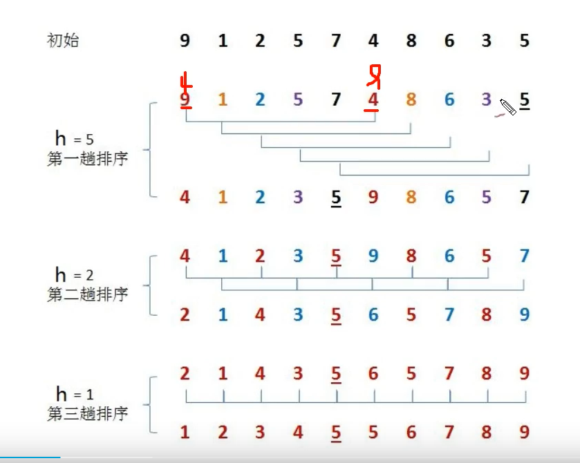

增长量h的确定：

```
int h =1
while(h < 数组长度/2){
	h = 2h+1;
}
//循环结束后我们就可以确定增长量的 值
h的减小规则：
	h = h/2
```

**希尔排序的API设计：**

| 类名     | Shell                                                        |
| -------- | ------------------------------------------------------------ |
| 构造方法 | Shell(): 创建shell对象                                       |
| 成员方法 | 1.public static void sort(Comparable[] a):对数组进行排序<br />2.private static boolean greater(Comparable v, Comparable w):判断v是否大于w<br />3.private static void exch(Comparable []a, int i, int j):交换a数组中的i, j的值 |

**希尔排序的java代码实现：**

```java
public class Shell{
    public static void sort(Comparable[] a){
        //1.根据数组a的长度确定增长量h
        int N = a.length;
        //确定增长量h的最大值
        int h = 1;
        while(h < N/2){
            h = h*2 + 1;
        }
        //当增长量h小于1, 排序结束
        while(h >= 1){
            //找到待插入排序的元素
            for(int i= h; i< N; i++){
                for(int j =i; j>= h; j-=h){
                    //待插入的元素是a[j], 比较a[j]和a[j-h]
                    if(greater(a[j-h],a[j])){
                        exch(a, j-h, j);
                    }else{
                        //待插入的元素已经找到合适的位置,结束循环
                        break;
                    }
                }
            }
            //减小h的值
            h = h/2;
        }
      }
     private static boolean greater(Comparable v, Comparable w){
          return v.compareTo(w)>0;
     }
    private static void exch(Comparable[] a, int i, int j){
        Comparable temp;
        temp = a[i];
        a[i] = a[j];
        a[j] = temp;
    }
    
}
```

**希尔排序的C++实现**

```c++
#include <iostream>
#include <vector>

using namespace std;

void exch(std::vector<int> &a, int i, int j)
{
    int temp = a[i];
    a[i] = a[j];
    a[j] = temp;
}

void sort(std::vector<int> &a)
{
    int N = a.size();
    //确定增长量
    int h = 1;
    while (h < N / 2)
    {
        h = h * 2 + 1;
    }
    while (h >= 1)
    {
        for (int i = h; i < N; i++)
        {
            for (int j = i; j >= h; j -= h)
            {
                if (a[j - h] - a[j] > 0)
                {
                    exch(a, j - h, j);
                }
                else
                    break;
            }
        }
        //逐渐减小增长量h的值
        h = h / 2;
    }
}

int main()
{
    vector<int> a = {9, 1, 2, 5, 7, 4, 8, 6, 3, 5};
    sort(a);
    cout << "The shell sort sequence is: " << endl;
    for (int i = 0; i < a.size(); i++)
    {
        cout << a.at(i) << " ";
    }
    return 0;
}
```

**希尔排序的时间复杂度分析**

事前复杂度分析方法涉及很复杂的数学计算，因此我们采用测试的方法进行复杂度的性能分析。


## 2.2 归并排序

### 2.2.1 递归算法

**定义：**

在方法内调用方法本身称之为递归。

```
public void show(){
	System.out.println("aaa");
	show();
}
```

**作用：**

它通常把一个大型复杂问题，层层转递为一个与原问题相似，规模较小的问题来求解。递归策略只需要少量的程序就可以描述解题过程需要的多次重复计算，大大减小程序的代码量。

**注意事项：**

在递归中，不能无线的调用自己，必须要有边界条件，能够让递归结束，因为每一次递归调用都会在栈内开辟新的空间，如果递归层级太深，很容易造成栈的内存溢出。

### 2.2.2 归并排序

归并排序是建立在归并操作上的一种算法，该算法采用分治策略。

**需求:**

排序前：{8，4，5，7，1，3，6，2}

排序后：{1，2，3，4，5，6，7，8}

**排序原理：**

1. 尽可能的一组数据拆分成两个元素相等的子组，并对每一子组进行继续拆分，直到拆分后的每个子组的元素个数是1为止。
2. 将相邻的两个子组进行合并成一个有序的大组。
3. 不断重复2， 直到最后一个组为止。

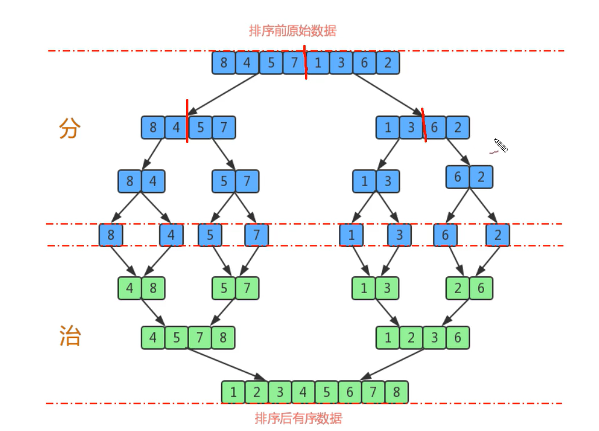

**归并排序的API设计：**

| 类名     | Merge                                                        |
| -------- | ------------------------------------------------------------ |
| 构造方法 | Merge():创建merge对象                                        |
| 成员方法 | 1.public static void sort(Comparable[] a):对数组进行排序<br />2.private static void sort(Comparable[] a, int lo, int hi):对数组a中从索引lo到hi之间的元素进行排序<br />3.private static void merge(Comparabel[] a, int lo, int mid, int hi):从索引lo到mid为一个子数组，从索引mid+1到hi为另外一个子数组，把数组a中这两个子组的数据合并成一个有序的大组<br />4.private static boolean less(Comparable v, Comparable w):判断v是否小于w<br />5.private static void exch(Comparable[] a, int i, int j):交换a数组中，索引i和索引j |
| 成员变量 | 1.private static Comparable[] assist:完成归并操作需要的辅助数组 |

**归并原理：**

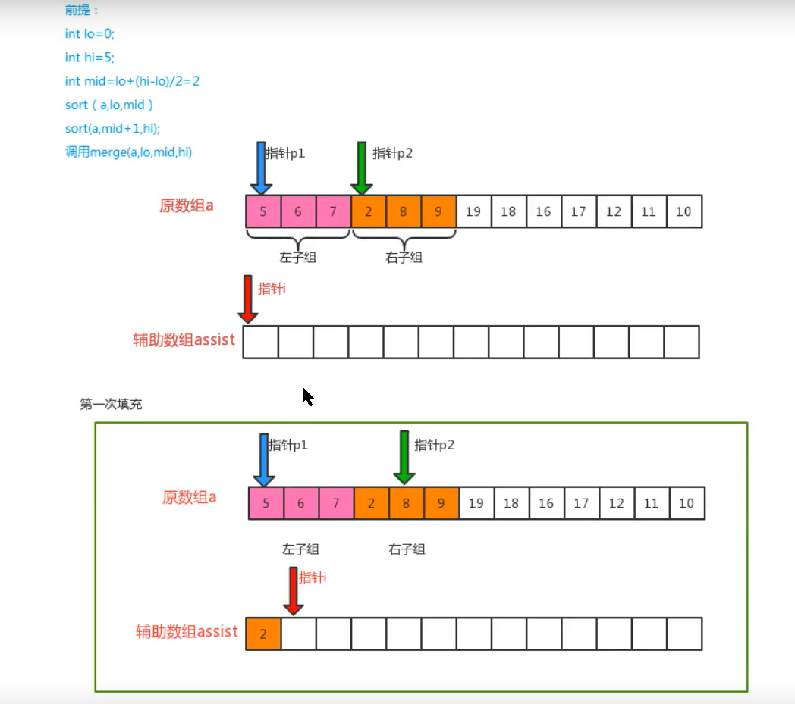

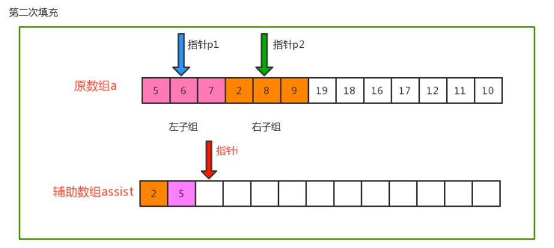

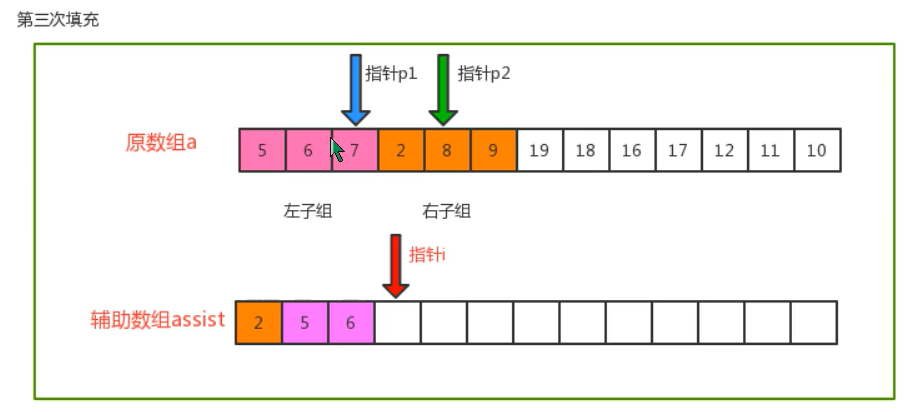

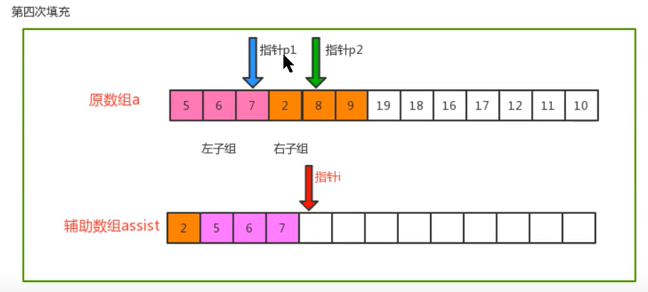

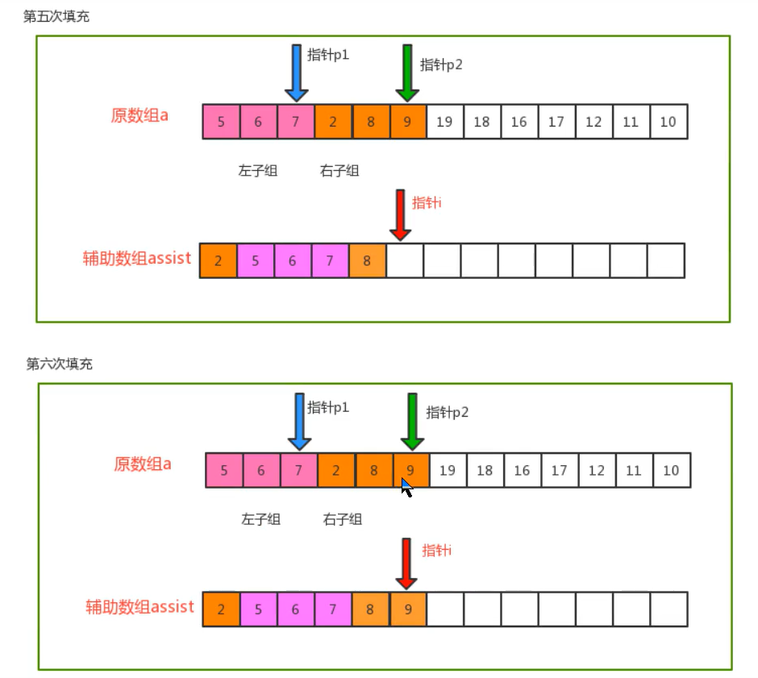


**归并排序的Java实现：**

```java
public class Merge{
    //归并排序需要的辅助数组
    private static Comparable[] assist;
    
    //比较v元素是否小于w元素
    private static boolean less(Comparable v, Comparbale w){
        return v.compareTo(w)<0;
    }
    
    //数组元素i 和j交换位置
    private static void exch(Comparbale[] a, int i, int j){
        Comparable t = a[i];
        a[i] = a[j];
        a[j] = t;
    }
    
    //对数组a中的元素进行排序
    public static void sort(Comparbale[] a){
        //1.初始化辅助数组assist
        assist = new Comparbale[a.length];
        //2.定义一个lo变量和一个hi变量，记录最小的索引和最大的索引
        int lo = 0;
        int hi = a.lenght-1;
        //3.调用sort重载方法，完成数组a中从lo到hi的排序
         sort(a, lo, hi);
    }
    //对数组a中从lo到hi的元素进行排序
    private static void sort(Comparbale[] a, int lo, int hi){
        //安全校验
        if(hi <=lo) return;
        //对lo到hi之间的数组分两个组
        int mid = lo + (hi -lo)/2;
        //分别对每一组数组进行排序
        sort(a, lo, mid);
        sort(a, mid+1, hi);
        //再把两个组的数据进行归并
        merge(a, lo, mid, hi);
    }
    
    //对数组中，从lo到mid为一组，从mid+1到hi为一组，对这两组数据归并
    private static void merge(Comparabel[] a, int lo, int mid, int hi){
        //定义三个指针
        int i = lo;
        int p1 = lo;
        int p2 = mid + 1;
        //遍历，移动p1指针和p2指针，找到小的值放到辅助数组中
        while(p1 <= mid && p2 <= hi){
            //比较对应索引处的值
            if(less(a[p1],a[p2])){
                assist[i++] = a[p1++];
            }else{
                assist[i++] = a[p2++];
            }
        }
        //遍历,如果p1的指针没走完，那么顺序移动p1指针，把对应元素放到辅助数组的对应索引处
        while(p1<=mid){
            assist[i++] = a[p1++];
        }
        //遍历,如果p2的指针没走完，那么顺序移动p1指针，把对应元素放到辅助数组的对应索引处
        while(p2<=hi){
            assist[i++] = a[p2++]
        }
        //把辅助数组中的元素拷贝到原数组中
        for(int index = lo; index <= hi; index++){
            a[index] = assist[index];
        }
    }
}
```

**归并排序的C++实现**

```c++
#include <iostream>
#include <vector>

using namespace std;

void Merge(std::vector<int> &a, int lo, int mid, int hi)
{
    //定义一个辅助数组
    int *assist = new int(a.size());
    int i = lo;
    int p1 = lo;
    int p2 = mid + 1;
    //遍历，移动p1指针和p2指针，找到小的值放到辅助数组中
    while (p1 <= mid && p2 <= hi)
    {
        if (a[p1] - a[p2] < 0)
        {
            assist[i++] = a[p1++];
        }
        else
        {
            assist[i++] = a[p2++];
        }
    }
    //遍历,如果p1的指针没走完，那么顺序移动p1指针，把对应元素放到辅助数组的对应索引处
    while (p1 <= mid)
    {
        assist[i++] = a[p1++];
    }
    //遍历,如果p2的指针没走完，那么顺序移动p1指针，把对应元素放到辅助数组的对应索引处
    while (p2 <= hi)
    {
        assist[i++] = a[p2++];
    }
    //把辅助数组中的元素拷贝到原数组中
    for (int index = lo; index <= hi; index++)
    {
        a[index] = assist[index];
    }
}

void Sort_1(std::vector<int> &a, int lo, int hi)
{
    //安全校验
    if (hi <= lo)
        return;
    //对lo和hi之间的数组进行分组
    int mid = lo + (hi - lo) / 2;
    //分别对每一组数进行排序,采用递归算法
    Sort_1(a, lo, mid);
    Sort_1(a, mid + 1, hi);
    //再把排号序的两个数组合并
    Merge(a, lo, mid, hi);
}

void Sort(std::vector<int> &a)
{
    //2.定义一个lo, 一个hi变量，记录最小索引和最大索引
    int lo = 0;
    int hi = a.size() - 1;
    //3.调用sort重载方法，对a数组的排序
    Sort_1(a, lo, hi);
}

void exch(std::vector<int> &a, int i, int j)
{
    int temp = a[i];
    a[i] = a[j];
    a[j] = temp;
}

int main()
{
    vector<int> a = {8, 4, 5, 7, 1, 3, 6, 2};
    Sort(a);
    for (int i = 0; i < a.size(); i++)
        cout << a[i] << endl;
    return 0;
}
```


**归并排序时间复杂度分析**

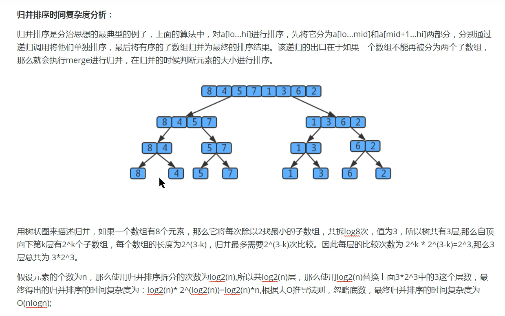

**归并排序的缺点**

需要申请额外的数组空间，导致空间复杂度上升，是典型的以空间换时间的操作。

