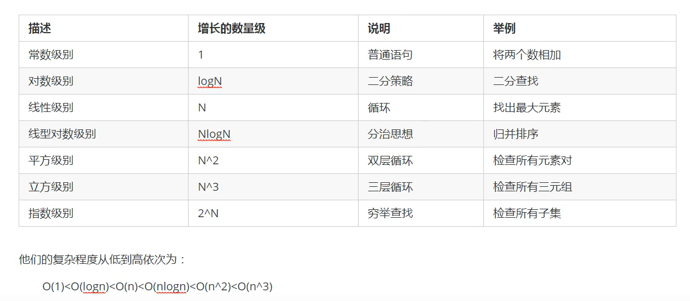

# 算法分析

如何花更少时间和内存去完成任务。

对时间和空间两个维度去分析

## 算法的时间复杂度分析

1. 事后分析估算方法

测试程序

```java
public static void main(String[] args){
    long start = System.currentTimeMills();
    
    int sum = 0;
    int n = 100;
    for(int i = 1; i<= n; i++){
        sum += i;
    }
    system.out.Println("sum = " + sum);
    
    long end = System.currentTimeMills();
    System.out.Println(end - start);
}
```


2. 事前分析估算法：

* 算法采用的策略和方案；
* 编译产生的代码质量；
* 问题的输入规模；
* 机器执行指令的速度。

例子：计算1到100的和

```java
public static void main(String [] args){
    int sum = 0; //执行1次
    int n = 100; //执行1次
    for(int i = 1; i<=n; i++){//执行n+1次
        sum += i;//执行n次
    }
    System.out.Println("sum=" + sum);
}
```

```java
public static void main(String [] args){
    int sum = 0; //执行1次
    int n = 100; //执行1次
    sum = (n+1)*n/2;//执行1次
    System.out.Println("sum=" + sum);
}
```

第一个算法执行了`1+1+(n+1)+n = 2n+3` ， 第二种算法执行了`1+1+1=3`次 

**为什么循环判断在算法分析中可以被忽略呢？**

研究算法复杂度，侧重点是当输入规模不断增大时，算法的增长量的一个抽象规律，而不是精确的定位需要执行多少次。分析算法的运行时间，**最重要的就是把核心操作的次数和输入的规模关联起来。**


### 函数渐进增长

概念：给定两个函数`f(n)`和`g(n)`， 如果存在一个整数`N`, 使得对于所有的`n>N`，`f(n)`总是比`g(n)`大，则`f(n)`的增长渐进快于`g(n)`。

实用的结论：

**随着输入规模的增大，算法的常数操作可以忽略不记**

**随着输入规模的增大，与最高次项的常数因子可以忽略不记**

**最高次项的指数大的，随着n的增长，结果会变得增长得特别快**

**算法函数中n最高次幂越小，算法效率越高**


### 算法时间复杂度 大O表示法

执行次数=执行时间

规则：

* 用常数1取代运行时间中的所有加法常数
* 在修改后的运行次数中，只保留高阶项
* 如果最高阶项存在，且常数因子不为1，则去除与这个项相乘的常数

常见的大O阶

1. 线性阶

最常见于单层循环

2. 平方阶

一般嵌套循环属于平方阶

3. 立方阶

一般三层嵌套循环属于这个时间复杂度

4. 对数阶

5. 常数阶





### 函数调用的时间复杂度分析

```java
public static void main(String [] args){
    int n = 100;
    for(int i = 0; i < n; i++){
        show(i);
    }
    private static void show(int i){
        System.out.Println(i);
    }
}
```


在main()方法中，有一个for循环，循环体调用了show方法，show中执行了一次，则 O（n）


## 算法的空间复杂度分析

基本数据类型的内存占用：


计算机访问内存的方式是每次一个字节


一个引用需要8个字节表示


一般内存使用，如果不够8个字节，都会被填充成8个字节 


# 排序算法

# 1. 简单排序

构造方法和成员方法 

## 1.1 冒泡排序(Bubble sort)

冒泡排序是一种简单的排序算法

**需求：**

排序前：{4，5，6，3，2，1}

排序后：{1，2，3，4，5，6}

**排序原理：**

1. 比较相邻的元素，如果前一个元素比后一个元素大，就交换这两个元素的位置。
2. 对每一对相邻元素做同样的工作，从开始第一对元素到结尾的最后一对元素，最终最后位置的元素就是最大值。


**冒泡排序API设计：**

| 类名     | Bubble                                                       |
| -------- | ------------------------------------------------------------ |
| 构造方法 | Bubble():创建Bubble对象                                      |
| 成员方法 | 1.public static void sort(Comparable[] a):对数组内的元素进行排序<br />2. private static boolean greater(Comparable v, Comparable w): 判断V是否大于W<br />3.private static void exch(Comparable[] a, int i, int j): 交换a数组中，索引i和索引j的值 |

**冒泡排序的代码实现：**

```java
//排序代码
public class Bubble{
    public static void sort(Comparable[] a){
        for(int i = a.lenght-1; i>0;i--){
            for(int j = 0; j < i; j++){
                if(greater(a[j], a[j+1])){
                    exch(a, j, j+1)
                }
            }
        }
    }
    private static boolean greater(Comparable v, comparable w){
    	return v.compareTo(w)>0;
      }
    private static void exch(Comparable[] a, int i, int j){
        Comparable temp;
        temp = a[i];
        a[i] = a[j];
        a[j] = temp;
    }
}
```

**冒泡排序的时间复杂度分析**

在最坏情况下：{6，5，4，3，2，1}：

元素的比较次数：

`(N-1)+(N-2)+(N-3)+...+2+1 = N^2/2-N/2`

元素的交换次数:

`(N-1)+(N-2)+(N-3)+...+2+1 = N^2/2-N/2`

总执行次数：

`(n^2/2-n/2)+(n^2/2-n/2) = n^2-n`

时间复杂度为：`O(N^2)`


## 1.2 选择排序

需求：

排序前：{4，6，8，7，9，2，10，1}

排序后：{1，2，4，5，7，8，9，10}

**排序原理**

1. 每一次遍历的过程中， 都假定第一个索引处的元素是最小值，和其他索引处的值依次进行比较，如果当前索引处的值大于其他某个索引处的值，则假定其他某个索引出的值为最小值，最后可以找到最小值所在的索引
2. 交换第一个索引处和最小值所在的索引处的值


**选择排序API设计：**

|   类名   | Selection                                                    |
| :------: | ------------------------------------------------------------ |
| 构造方法 | Selection(): 创建Selection对象                               |
| 成员方法 | 1. public static void sort(Comparable[] a): 对数组内的元素进行排序<br />2. private static boolean greater(Comparable v, Comparable w): 判断v是否大于w<br />3. private static void exch(Comparable[] a, int i, int j):交换数组a中索引i和索引j处的值 |

**选择排序算法代码实现：**

```java
//排序代码
public class Selection{
    //对数组a中的元素进行排序
    public static void sort(Comparable[] a){
        for(int i = 0; i <= a.length -2; i++){
             //假定本次遍历，最小值所在的索引是i
        	int minIndex = i;
        	for(int j = i+1; j< a.length; j++){
                //比较最小索引处的值和minIndex的值
            	if(greater(a[minIndex], a[j])){
                	//更换最小值所在的索引
                	minIndex = j;
            	}
       		 }
           	//交换i索引处和minIndenx索引处的值
        	exch(a, i, minIndex);
     	}
        
    }
    private static boolean greater(Comparable v, Comparable w){
        return v.compareTo(w) > 0;
    }
    private staic void exch(Comparable[] a, int i, int j){
        Comparable temp;
        temp = a[i];
        a[i] = a[j];
        a[j] = temp;
    }
}
```

**选择排序的时间复杂度分析**

选择排序使用了双层for循环，其中外层循环完成了数据交换，内层循环完成了数据比较，所以我们分析数据交换次数和数据比较次数：

数据比较次数：

`(N-1)+(N-2)+...+2+1 = ((N-1)+1)*(N-1)/2=N^2/2-N/2;`

数据交换次数：

`(N-1)`

时间复杂度：

`N^2/2-N/2+(N-1)=N^2/2+N/2-1;`

时间复杂度为`O(N^2);`

### 

## 1.3 插入排序

插入排序（insertion sort）是一种简单直观且稳定的排序算法。

插入排序的工作方式非常像人们排序一手扑克牌一样。开始时，我们的左手为空并且桌子上的牌面朝下。然后，我们每次从桌上拿走一张牌并将它插入左手中正确的位置。为了找到一张牌的正确位置，我们从右到左将它与已经在手的牌进行比较。

需求：

排序前：{4，3，2，10，12，1，5，6}

排序后：{1，2，3，4，5，6，10，12}

**排序原理**

1. 把所有的元素分成两组，已经排序和未排序的
2. 找到未排序的组中的第一个元素，向已经排序的组中进行插入；
3. 倒叙遍历已经排序的元素，依次和待插入的元素进行比较，直到直到一个元素小于等于待插入排序元素，那么久把待插入元素放到这个位置，其他元素向后移动一位。


**插入排序API设计：**

| 类名     | Insertion                                                    |
| -------- | ------------------------------------------------------------ |
| 构造方法 | Insertion():创建Inertation对象                               |
| 成员方法 | 1.public static void sort(Comparable[] a):对数组内的元素进行排序<br />2. private static void boolean greater(Comparable v, Comparable w):判断v和w大小<br />3. private static void exch(Comparable[] a, int i, int j)：交换数组中索引i 和索引j 的值 |

**插入排序的实现**

```java
public class Insertion{
    public static void sort(Comparable[] a){
        for(int i= 1; i < a.lenght;i++){
            //当前元素为a[i],依次和i前面的元素比较，找到一个小于等于a[i]的元素
            for(int j = i; j>0; j--){
                //比较j 和j-1的值
                if(greater(a[j-1], a[j])){
                    //交换元素
                    exch(a, j-1, j);
                }
                else{
                    //找到元素
                    break;
                }
            }
        }
    }
    
    private static boolean greater(Comparable v, Comparable w){
        return v.compareTo(w) > 0;
    }
    
    private staic void exch(Comparable[] a, int i, int j){
        Comparable temp;
        temp = a[i];
        a[i] = a[j];
        a[j] = temp;
    }
    
}
```

**插入排序的时间复杂度分析**

插入排序使用了双层for循环，其中内层循环的循环体是真正完成排序的代码

比较次数：

`(N-1)+(N-2)+...+2+1 = N^2/2-N/2`

交换次数：

`(N-1)+(N-2)+...+2+1 = N^2/2-N/2`

总的执行次数：

`N^2-N`

则时间复杂度为：`O(N^2)`

# 2. 高级排序

冒泡排序，选择排序和插入排序的时间复杂度都是平方阶，随着数据输入的增大，时间成本急剧上升，这些方法不可能用于解决大规模的排序问题。

## 2.1 希尔排序

希尔排序是插入排序的一种，又叫“缩小增量排序”，是插入排序算法的一种更高效的改进版本。

需求：

排序前：{9，1，2，5，7，4，8，6，3，5}

排序后：{1，2，3，4，5，5，6，7，8，9}

排序原理：

1. 选定一个增长量h，按照增长量h作为数据分组的依据，对数据进行分组；
2. 对分好的组的每一个数据完成插入排序；
3. 减小增长量，最小减为1，重复第二步的操作


