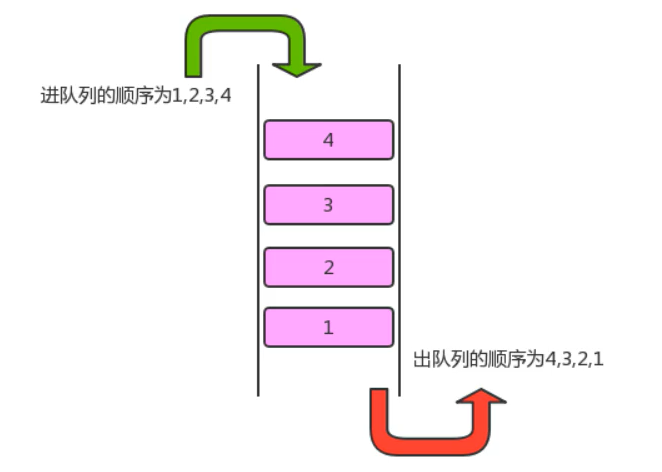

- [ 算法分析](#head1)
- [1. 算法的时间复杂度分析](#head2)
	- [1.1 函数渐进增长](#head3)
	- [1.2 算法时间复杂度 大O表示法](#head4)
	- [1.3 函数调用的时间复杂度分析](#head5)
	- [1.4 算法的空间复杂度分析](#head6)
- [2. 排序算法](#head7)
- [2.1 简单排序](#head8)
	- [2.1.1 冒泡排序(Bubble sort)](#head9)
	- [2.1.2 选择排序](#head10)
	- [2.1.3 插入排序](#head11)
- [2.2 高级排序](#head12)
	- [2.2.1 希尔排序](#head13)
	- [2.2.2 归并排序](#head14)
		- [2.2.2.1 递归算法](#head15)
		- [2.2.2.2 归并排序](#head16)
	- [2.2.3 快速排序 ](#head17)
	- [2.2.4 排序的稳定性](#head18)
- [3. 线性表](#head19)
	- [3.1 顺序表](#head20)
		- [3.1.1 顺序表的实现](#head21)
		- [3.1.2 顺序表的遍历](#head22)
		- [3.1.3 顺序表的容量可变](#head23)
		- [3.1.4 顺序表的时间复杂度](#head24)
	- [3.2 链表](#head25)
		- [3.2.1 单向链表](#head26)
		- [3.2.2 双向链表](#head27)
		- [3.2.3 链表的复杂度分析](#head28)
		- [3.2.4 链表反转](#head29)
		- [3.2.5 快慢指针 ](#head30)
		- [3.2.6 单向链表是否有环问题](#head31)
		- [3.2.7 循环链表](#head32)
		- [3.2.8 约瑟夫问题](#head33)
	- [3.3 栈](#head34)
		- [3.3.1 栈的概述](#head35)
		- [3.3.2 栈的实现 ](#head36)
		- [3.3.3 案例](#head37)
	- [3.4 队列](#head38)
- [4. 符号表](#head39)
	- [4.1 符号表的API设计](#head40)
	- [4.2 符号表的实现](#head41)
- [5. 树](#head42)
	- [5.1 树的基本定义](#head43)
	- [5.2 树的相关术语](#head44)
	- [5.3 二叉树的基本定义](#head45)
	- [5.4 二叉查找树的创建](#head46)
		- [5.4.1 二叉树的结点类](#head47)
		- [5.4.2 二叉查找树的实现](#head48)


# <span id="head1"> 算法分析</span>

[TOC]

如何花更少时间和内存去完成任务。

对时间和空间两个维度去分析

# <span id="head2">1. 算法的时间复杂度分析</span>

1. 事后分析估算方法

测试程序

```java
public static void main(String[] args){
    long start = System.currentTimeMills();
    
    int sum = 0;
    int n = 100;
    for(int i = 1; i<= n; i++){
        sum += i;
    }
    system.out.Println("sum = " + sum);
    
    long end = System.currentTimeMills();
    System.out.Println(end - start);
}
```


2. 事前分析估算法：

* 算法采用的策略和方案；
* 编译产生的代码质量；
* 问题的输入规模；
* 机器执行指令的速度。

例子：计算1到100的和

```java
public static void main(String [] args){
    int sum = 0; //执行1次
    int n = 100; //执行1次
    for(int i = 1; i<=n; i++){//执行n+1次
        sum += i;//执行n次
    }
    System.out.Println("sum=" + sum);
}
```

```java
public static void main(String [] args){
    int sum = 0; //执行1次
    int n = 100; //执行1次
    sum = (n+1)*n/2;//执行1次
    System.out.Println("sum=" + sum);
}
```

第一个算法执行了`1+1+(n+1)+n = 2n+3` ， 第二种算法执行了`1+1+1=3`次 

**为什么循环判断在算法分析中可以被忽略呢？**

研究算法复杂度，侧重点是当输入规模不断增大时，算法的增长量的一个抽象规律，而不是精确的定位需要执行多少次。分析算法的运行时间，**最重要的就是把核心操作的次数和输入的规模关联起来。**


## <span id="head3">1.1 函数渐进增长</span>

概念：给定两个函数`f(n)`和`g(n)`， 如果存在一个整数`N`, 使得对于所有的`n>N`，`f(n)`总是比`g(n)`大，则`f(n)`的增长渐进快于`g(n)`。

实用的结论：

**随着输入规模的增大，算法的常数操作可以忽略不记**

**随着输入规模的增大，与最高次项的常数因子可以忽略不记**

**最高次项的指数大的，随着n的增长，结果会变得增长得特别快**

**算法函数中n最高次幂越小，算法效率越高**

## <span id="head4">1.2 算法时间复杂度 大O表示法</span>

执行次数=执行时间

规则：

* 用常数1取代运行时间中的所有加法常数
* 在修改后的运行次数中，只保留高阶项
* 如果最高阶项存在，且常数因子不为1，则去除与这个项相乘的常数

常见的大O阶

1. 线性阶

最常见于单层循环

2. 平方阶

一般嵌套循环属于平方阶

3. 立方阶

一般三层嵌套循环属于这个时间复杂度

4. 对数阶

5. 常数阶


## <span id="head5">1.3 函数调用的时间复杂度分析</span>

```java
public static void main(String [] args){
    int n = 100;
    for(int i = 0; i < n; i++){
        show(i);
    }
    private static void show(int i){
        System.out.Println(i);
    }
}
```


在main()方法中，有一个for循环，循环体调用了show方法，show中执行了一次，则 O（n）


## <span id="head6">1.4 算法的空间复杂度分析</span>

基本数据类型的内存占用：


计算机访问内存的方式是每次一个字节


一个引用需要8个字节表示


一般内存使用，如果不够8个字节，都会被填充成8个字节 


# <span id="head7">2. 排序算法</span>

# <span id="head8">2.1 简单排序</span>

构造方法和成员方法 

## <span id="head9">2.1.1 冒泡排序(Bubble sort)</span>

冒泡排序是一种简单的排序算法

**需求：**

排序前：{4，5，6，3，2，1}

排序后：{1，2，3，4，5，6}

**排序原理：**

1. 比较相邻的元素，如果前一个元素比后一个元素大，就交换这两个元素的位置。
2. 对每一对相邻元素做同样的工作，从开始第一对元素到结尾的最后一对元素，最终最后位置的元素就是最大值。


**冒泡排序API设计：**

| 类名     | Bubble                                                       |
| -------- | ------------------------------------------------------------ |
| 构造方法 | Bubble():创建Bubble对象                                      |
| 成员方法 | 1.public static void sort(Comparable[] a):对数组内的元素进行排序<br />2. private static boolean greater(Comparable v, Comparable w): 判断V是否大于W<br />3.private static void exch(Comparable[] a, int i, int j): 交换a数组中，索引i和索引j的值 |

**冒泡排序的代码实现：**

```java
//排序代码
public class Bubble{
    public static void sort(Comparable[] a){
        for(int i = a.lenght-1; i>0;i--){
            for(int j = 0; j < i; j++){
                if(greater(a[j], a[j+1])){
                    exch(a, j, j+1)
                }
            }
        }
    }
    private static boolean greater(Comparable v, comparable w){
    	return v.compareTo(w)>0;
      }
    private static void exch(Comparable[] a, int i, int j){
        Comparable temp;
        temp = a[i];
        a[i] = a[j];
        a[j] = temp;
    }
}
```

**冒泡排序的C++代码实现**

```c++
#include <iostream>
#include <vector>
using namespace std;

void swap(std::vector<int> &a, int i, int j){
    int t = a[i];
    a[i] = a[j];
    a[j] = t;
}


void bubble_sort(std::vector<int> &a){
    int len = a.size();
    for(int i = len -1; i>0; i--){
        for(int j = 0; j<i;j++){
            if(a[j+1] < a[j]){
                swap(a, j, j+1);
            }
        }
    }
}


int main(int argc, char** argv){
    vector<int> a = {6,5,4,3,2,1};
    bubble_sort(a);
    cout<< "the sequence for the bubble sort:"<<endl;
    for(int i=0; i<a.size();i++){
        cout<<a.at(i)<<" ";
    }
    return 0;
}
```

**冒泡排序的时间复杂度分析**

在最坏情况下：{6，5，4，3，2，1}：

元素的比较次数：

`(N-1)+(N-2)+(N-3)+...+2+1 = N^2/2-N/2`

元素的交换次数:

`(N-1)+(N-2)+(N-3)+...+2+1 = N^2/2-N/2`

总执行次数：

`(n^2/2-n/2)+(n^2/2-n/2) = n^2-n`

时间复杂度为：`O(N^2)`


## <span id="head10">2.1.2 选择排序</span>

需求：

排序前：{4，6，8，7，9，2，10，1}

排序后：{1，2，4，5，7，8，9，10}

**排序原理**

1. 每一次遍历的过程中， 都假定第一个索引处的元素是最小值，和其他索引处的值依次进行比较，如果当前索引处的值大于其他某个索引处的值，则假定其他某个索引出的值为最小值，最后可以找到最小值所在的索引
2. 交换第一个索引处和最小值所在的索引处的值


**选择排序API设计：**

|   类名   | Selection                                                    |
| :------: | ------------------------------------------------------------ |
| 构造方法 | Selection(): 创建Selection对象                               |
| 成员方法 | 1. public static void sort(Comparable[] a): 对数组内的元素进行排序<br />2. private static boolean greater(Comparable v, Comparable w): 判断v是否大于w<br />3. private static void exch(Comparable[] a, int i, int j):交换数组a中索引i和索引j处的值 |

**选择排序算法代码实现：**

```java
//排序代码
public class Selection{
    //对数组a中的元素进行排序
    public static void sort(Comparable[] a){
        for(int i = 0; i <= a.length -2; i++){
             //假定本次遍历，最小值所在的索引是i
        	int minIndex = i;
        	for(int j = i+1; j< a.length; j++){
                //比较最小索引处的值和minIndex的值
            	if(greater(a[minIndex], a[j])){
                	//更换最小值所在的索引
                	minIndex = j;
            	}
       		 }
           	//交换i索引处和minIndenx索引处的值
        	exch(a, i, minIndex);
     	}
        
    }
    private static boolean greater(Comparable v, Comparable w){
        return v.compareTo(w) > 0;
    }
    private staic void exch(Comparable[] a, int i, int j){
        Comparable temp;
        temp = a[i];
        a[i] = a[j];
        a[j] = temp;
    }
}
```

**选择排序的C++代码实现：**

```c++
#include <iostream>
#include <vector>

using namespace std;


void exch(std::vector<int> &a, int i, int j){
    int t = a[i];
    a[i] = a[j];
    a[j] = t;
}

void sort(std::vector<int> &a){
    for(int i = 0; i<= a.size()-2; i++){
        int minIndex = i;
        for(int j = i+1; j< a.size(); j++){
            if(a[minIndex] - a[j] > 0){
                minIndex = j;
            }
        }
        exch(a, i, minIndex);
    }
}


int main(int argc, char** argv){
    vector<int> a = {4,6,8,7,9,2,10,1};
    sort(a);
    cout<<"The sequence after the selection sort:"<<endl;
    for(int i=0; i<a.size();i++){
        cout<< a.at(i)<<" ";
    }
    return 0;
}
```

**选择排序的时间复杂度分析**

选择排序使用了双层for循环，其中外层循环完成了数据交换，内层循环完成了数据比较，所以我们分析数据交换次数和数据比较次数：

数据比较次数：

`(N-1)+(N-2)+...+2+1 = ((N-1)+1)*(N-1)/2=N^2/2-N/2;`

数据交换次数：

`(N-1)`

时间复杂度：

`N^2/2-N/2+(N-1)=N^2/2+N/2-1;`

时间复杂度为`O(N^2);`


## <span id="head11">2.1.3 插入排序</span>

插入排序（insertion sort）是一种简单直观且稳定的排序算法。

插入排序的工作方式非常像人们排序一手扑克牌一样。开始时，我们的左手为空并且桌子上的牌面朝下。然后，我们每次从桌上拿走一张牌并将它插入左手中正确的位置。为了找到一张牌的正确位置，我们从右到左将它与已经在手的牌进行比较。

需求：

排序前：{4，3，2，10，12，1，5，6}

排序后：{1，2，3，4，5，6，10，12}

**排序原理**

1. 把所有的元素分成两组，已经排序和未排序的
2. 找到未排序的组中的第一个元素，向已经排序的组中进行插入；
3. 倒叙遍历已经排序的元素，依次和待插入的元素进行比较，直到直到一个元素小于等于待插入排序元素，那么久把待插入元素放到这个位置，其他元素向后移动一位。


**插入排序API设计：**

| 类名     | Insertion                                                    |
| -------- | ------------------------------------------------------------ |
| 构造方法 | Insertion():创建Inertation对象                               |
| 成员方法 | 1.public static void sort(Comparable[] a):对数组内的元素进行排序<br />2. private static void boolean greater(Comparable v, Comparable w):判断v和w大小<br />3. private static void exch(Comparable[] a, int i, int j)：交换数组中索引i 和索引j 的值 |

**插入排序的实现**

```java
public class Insertion{
    public static void sort(Comparable[] a){
        for(int i= 1; i < a.lenght;i++){
            //当前元素为a[i],依次和i前面的元素比较，找到一个小于等于a[i]的元素
            for(int j = i; j>0; j--){
                //比较j 和j-1的值
                if(greater(a[j-1], a[j])){
                    //交换元素
                    exch(a, j-1, j);
                }
                else{
                    //找到元素
                    break;
                }
            }
        }
    }
    
    private static boolean greater(Comparable v, Comparable w){
        return v.compareTo(w) > 0;
    }
    
    private staic void exch(Comparable[] a, int i, int j){
        Comparable temp;
        temp = a[i];
        a[i] = a[j];
        a[j] = temp;
    }
    
}
```

**插入排序的C++代码实现：**

```c++
#include <iostream>
#include <vector>

using namespace std;

void exch(std::vector<int> &a, int i, int j)
{
    int temp = a[i];
    a[i] = a[j];
    a[j] = temp;
}

void insert_sort(std::vector<int> &a)
{
    for (int i = 1; i < a.size(); i++)
    {
        for (int j = i; j > 0; j--)
        {
            if (a[j - 1] - a[j] > 0)
            {
                exch(a, j - 1, j);
            }
            else
                break;
        }
    }
}

int main(int argc, char **argv)
{
    vector<int> a = {4, 6, 8, 7, 9, 2, 10, 1};
    insert_sort(a);
    cout << "The sequence after the insert sort:" << endl;
    for (int i = 0; i < a.size(); i++)
    {
        cout << a.at(i) << " ";
    }
    return 0;
}
```


**插入排序的时间复杂度分析**

插入排序使用了双层for循环，其中内层循环的循环体是真正完成排序的代码

比较次数：

`(N-1)+(N-2)+...+2+1 = N^2/2-N/2`

交换次数：

`(N-1)+(N-2)+...+2+1 = N^2/2-N/2`

总的执行次数：

`N^2-N`

则时间复杂度为：`O(N^2)`

# <span id="head12">2.2 高级排序</span>

冒泡排序，选择排序和插入排序的时间复杂度都是平方阶，随着数据输入的增大，时间成本急剧上升，这些方法不可能用于解决大规模的排序问题。高级排序可以大规模的减小时间消耗，希尔排序，归并排序，快速排序等。

## <span id="head13">2.2.1 希尔排序</span>

希尔排序是插入排序的一种，又叫“缩小增量排序”，是插入排序算法的一种更高效的改进版本。

需求：

排序前：{9，1，2，5，7，4，8，6，3，5}

排序后：{1，2，3，4，5，5，6，7，8，9}

**排序原理：**

1. 选定一个增长量h，按照增长量h作为数据分组的依据，对数据进行分组；
2. 对分好的组的每一个数据完成插入排序；
3. 减小增长量，最小减为1，重复第二步的操作


增长量h的确定：

```
int h =1
while(h < 数组长度/2){
	h = 2h+1;
}
//循环结束后我们就可以确定增长量的 值
h的减小规则：
	h = h/2
```

**希尔排序的API设计：**

| 类名     | Shell                                                        |
| -------- | ------------------------------------------------------------ |
| 构造方法 | Shell(): 创建shell对象                                       |
| 成员方法 | 1.public static void sort(Comparable[] a):对数组进行排序<br />2.private static boolean greater(Comparable v, Comparable w):判断v是否大于w<br />3.private static void exch(Comparable []a, int i, int j):交换a数组中的i, j的值 |

**希尔排序的java代码实现：**

```java
public class Shell{
    public static void sort(Comparable[] a){
        //1.根据数组a的长度确定增长量h
        int N = a.length;
        //确定增长量h的最大值
        int h = 1;
        while(h < N/2){
            h = h*2 + 1;
        }
        //当增长量h小于1, 排序结束
        while(h >= 1){
            //找到待插入排序的元素
            for(int i= h; i< N; i++){
                for(int j =i; j>= h; j-=h){
                    //待插入的元素是a[j], 比较a[j]和a[j-h]
                    if(greater(a[j-h],a[j])){
                        exch(a, j-h, j);
                    }else{
                        //待插入的元素已经找到合适的位置,结束循环
                        break;
                    }
                }
            }
            //减小h的值
            h = h/2;
        }
      }
     private static boolean greater(Comparable v, Comparable w){
          return v.compareTo(w)>0;
     }
    private static void exch(Comparable[] a, int i, int j){
        Comparable temp;
        temp = a[i];
        a[i] = a[j];
        a[j] = temp;
    }
    
}
```

**希尔排序的C++实现**

```c++
#include <iostream>
#include <vector>

using namespace std;

void exch(std::vector<int> &a, int i, int j)
{
    int temp = a[i];
    a[i] = a[j];
    a[j] = temp;
}

void sort(std::vector<int> &a)
{
    int N = a.size();
    //确定增长量
    int h = 1;
    while (h < N / 2)
    {
        h = h * 2 + 1;
    }
    while (h >= 1)
    {
        for (int i = h; i < N; i++)
        {
            for (int j = i; j >= h; j -= h)
            {
                if (a[j - h] - a[j] > 0)
                {
                    exch(a, j - h, j);
                }
                else
                    break;
            }
        }
        //逐渐减小增长量h的值
        h = h / 2;
    }
}

int main()
{
    vector<int> a = {9, 1, 2, 5, 7, 4, 8, 6, 3, 5};
    sort(a);
    cout << "The shell sort sequence is: " << endl;
    for (int i = 0; i < a.size(); i++)
    {
        cout << a.at(i) << " ";
    }
    return 0;
}
```

**希尔排序的时间复杂度分析**

事前复杂度分析方法涉及很复杂的数学计算，因此我们采用测试的方法进行复杂度的性能分析。


## <span id="head14">2.2.2 归并排序</span>

### <span id="head15">2.2.2.1 递归算法</span>

**定义：**

在方法内调用方法本身称之为递归。

```
public void show(){
	System.out.println("aaa");
	show();
}
```

**作用：**

它通常把一个大型复杂问题，层层转递为一个与原问题相似，规模较小的问题来求解。递归策略只需要少量的程序就可以描述解题过程需要的多次重复计算，大大减小程序的代码量。

**注意事项：**

在递归中，不能无线的调用自己，必须要有边界条件，能够让递归结束，因为每一次递归调用都会在栈内开辟新的空间，如果递归层级太深，很容易造成栈的内存溢出。

### <span id="head16">2.2.2.2 归并排序</span>

归并排序是建立在归并操作上的一种算法，该算法采用分治策略。

**需求:**

排序前：{8，4，5，7，1，3，6，2}

排序后：{1，2，3，4，5，6，7，8}

**排序原理：**

1. 尽可能的一组数据拆分成两个元素相等的子组，并对每一子组进行继续拆分，直到拆分后的每个子组的元素个数是1为止。
2. 将相邻的两个子组进行合并成一个有序的大组。
3. 不断重复2， 直到最后一个组为止。


**归并排序的API设计：**

| 类名     | Merge                                                        |
| -------- | ------------------------------------------------------------ |
| 构造方法 | Merge():创建merge对象                                        |
| 成员方法 | 1.public static void sort(Comparable[] a):对数组进行排序<br />2.private static void sort(Comparable[] a, int lo, int hi):对数组a中从索引lo到hi之间的元素进行排序<br />3.private static void merge(Comparabel[] a, int lo, int mid, int hi):从索引lo到mid为一个子数组，从索引mid+1到hi为另外一个子数组，把数组a中这两个子组的数据合并成一个有序的大组<br />4.private static boolean less(Comparable v, Comparable w):判断v是否小于w<br />5.private static void exch(Comparable[] a, int i, int j):交换a数组中，索引i和索引j |
| 成员变量 | 1.private static Comparable[] assist:完成归并操作需要的辅助数组 |

**归并原理：**


**归并排序的Java实现：**

```java
public class Merge{
    //归并排序需要的辅助数组
    private static Comparable[] assist;
    
    //比较v元素是否小于w元素
    private static boolean less(Comparable v, Comparbale w){
        return v.compareTo(w)<0;
    }
    
    //数组元素i 和j交换位置
    private static void exch(Comparbale[] a, int i, int j){
        Comparable t = a[i];
        a[i] = a[j];
        a[j] = t;
    }
    
    //对数组a中的元素进行排序
    public static void sort(Comparbale[] a){
        //1.初始化辅助数组assist
        assist = new Comparbale[a.length];
        //2.定义一个lo变量和一个hi变量，记录最小的索引和最大的索引
        int lo = 0;
        int hi = a.lenght-1;
        //3.调用sort重载方法，完成数组a中从lo到hi的排序
         sort(a, lo, hi);
    }
    //对数组a中从lo到hi的元素进行排序
    private static void sort(Comparbale[] a, int lo, int hi){
        //安全校验
        if(hi <=lo) return;
        //对lo到hi之间的数组分两个组
        int mid = lo + (hi -lo)/2;
        //分别对每一组数组进行排序
        sort(a, lo, mid);
        sort(a, mid+1, hi);
        //再把两个组的数据进行归并
        merge(a, lo, mid, hi);
    }
    
    //对数组中，从lo到mid为一组，从mid+1到hi为一组，对这两组数据归并
    private static void merge(Comparabel[] a, int lo, int mid, int hi){
        //定义三个指针
        int i = lo;
        int p1 = lo;
        int p2 = mid + 1;
        //遍历，移动p1指针和p2指针，找到小的值放到辅助数组中
        while(p1 <= mid && p2 <= hi){
            //比较对应索引处的值
            if(less(a[p1],a[p2])){
                assist[i++] = a[p1++];
            }else{
                assist[i++] = a[p2++];
            }
        }
        //遍历,如果p1的指针没走完，那么顺序移动p1指针，把对应元素放到辅助数组的对应索引处
        while(p1<=mid){
            assist[i++] = a[p1++];
        }
        //遍历,如果p2的指针没走完，那么顺序移动p1指针，把对应元素放到辅助数组的对应索引处
        while(p2<=hi){
            assist[i++] = a[p2++]
        }
        //把辅助数组中的元素拷贝到原数组中
        for(int index = lo; index <= hi; index++){
            a[index] = assist[index];
        }
    }
}
```

**归并排序的C++实现**

```c++
#include <iostream>
#include <vector>

using namespace std;

void Merge(std::vector<int> &a, int lo, int mid, int hi)
{
    //定义一个辅助数组
    int *assist = new int(a.size());
    int i = lo;
    int p1 = lo;
    int p2 = mid + 1;
    //遍历，移动p1指针和p2指针，找到小的值放到辅助数组中
    while (p1 <= mid && p2 <= hi)
    {
        if (a[p1] - a[p2] < 0)
        {
            assist[i++] = a[p1++];
        }
        else
        {
            assist[i++] = a[p2++];
        }
    }
    //遍历,如果p1的指针没走完，那么顺序移动p1指针，把对应元素放到辅助数组的对应索引处
    while (p1 <= mid)
    {
        assist[i++] = a[p1++];
    }
    //遍历,如果p2的指针没走完，那么顺序移动p1指针，把对应元素放到辅助数组的对应索引处
    while (p2 <= hi)
    {
        assist[i++] = a[p2++];
    }
    //把辅助数组中的元素拷贝到原数组中
    for (int index = lo; index <= hi; index++)
    {
        a[index] = assist[index];
    }
}

void Sort_1(std::vector<int> &a, int lo, int hi)
{
    //安全校验
    if (hi <= lo)
        return;
    //对lo和hi之间的数组进行分组
    int mid = lo + (hi - lo) / 2;
    //分别对每一组数进行排序,采用递归算法
    Sort_1(a, lo, mid);
    Sort_1(a, mid + 1, hi);
    //再把排号序的两个数组合并
    Merge(a, lo, mid, hi);
}

void Sort(std::vector<int> &a)
{
    //2.定义一个lo, 一个hi变量，记录最小索引和最大索引
    int lo = 0;
    int hi = a.size() - 1;
    //3.调用sort重载方法，对a数组的排序
    Sort_1(a, lo, hi);
}

void exch(std::vector<int> &a, int i, int j)
{
    int temp = a[i];
    a[i] = a[j];
    a[j] = temp;
}

int main()
{
    vector<int> a = {8, 4, 5, 7, 1, 3, 6, 2};
    Sort(a);
    for (int i = 0; i < a.size(); i++)
        cout << a[i] << endl;
    return 0;
}
```


**归并排序时间复杂度分析**


**归并排序的缺点**

需要申请额外的数组空间，导致空间复杂度上升，是典型的以空间换时间的操作。

## <span id="head17">2.2.3 快速排序 </span>

快速排序是对冒泡排序的一种改进。基本思想是：通过一趟排序将要排序的数据分割成独立的两个部分，其中一个部分的所有数据都比另外一个部分的所有数据都要小，然后再按照次方法对着两部分数组分别进行快速排序，整个排序国城可以递归进行，从而达到整个数据变成有序序列。

**需求：**

排序前：{6，1，2，7，9，3，4，5，8}

排序后：{1，2，3，4，5，6，7，8，9}

**排序原理：**

1. 首先设定一个分界值，通过该分界值将数组分成左右两个部分；
2. 将大于或等于分界值的数据放到数组右边，小于分界值的数据放到数组的左边。此时左边部分中各元素都小于或等于分界值，而右边部分中各元素都大于或等于分界值；
3. 然后，左边和哟便的数据可以独立排序，对于左侧的数组数据，又可以去一个分界值，将该部分数据分成左右两个部分，同样再左边放置较小值，再右边放置较大值，右侧的数据一次类似处理；
4. 重复上述过程，可以看出，这是一个递归的定义，通过递归将左侧部分排好序后，再递归排序右侧部分，当左侧和右侧两个部分的数据排序完成后，整个数组的排序也就完成了。


**快速排序API设计：**

| 类名     | Quick                                                        |
| -------- | ------------------------------------------------------------ |
| 构造方法 | Quick(): 创建Quick对象                                       |
| 成员方法 | 1.public static void sort(Comparable [] a):对数组内的元素进行排序<br />2.private static void sort(Comparable[] a, int lo, int hi):对数组a中从索引lo到hi之间的元素进行排序<br />3.public static int partition(Comparabel[] a, int lo, int hi):对数组a中，从索引lo到索引hi之间的元素进行分组，并返回分组界限对应的索引<br />4.private static boolean less(Comparable v, Comparable w):判断v是否小于w<br />5.private static void exch(Comparable[] a, int i, int j):交换a数组中，索引i和索引j |

**切分原理：**

把一个数组切分成两个子数组的基本思想：

1. 找一个基准值，用两个指针分别指向数组的头部和尾部；
2. 先从尾部向头部开始搜索一个比基准值小的元素，搜索到即停止，并记录指针的位置；
3. 再从头部向尾部开始搜索一个比基准值大的元素，搜索到即停止，并记录指针的位置；
4. 交换当前左边指针的位置和右边指针位置的元素；
5. 重复2，3，4步骤，直到左边指针的值大于右边指针的值停止。


**快速排序的Java代码实现：**

```java
public class Quick{
    //比较v元素是否小于w元素
    private static boolean less(Comparable v, Comparable w){
        return v.compareTo(w) < 0;
    }
    
    //数组元素i和j交换位置
    private static void exch(Comparable[] a, int i, int j) {
        Comparable t = a[i];
        a[i] = a[j];
        a[j] = t;
    }
    
    //对数组内的元素进行排序
    public static void sort(Comparable[] a){
        int lo = 0;
        int hi = a.length - 1;
        sort(a, lo, hi);
    }
    
    //对数组a中从索引lo到索引hi之间的元素进行排序
    private static void sort(Comparable [] a, int lo, int hi) {
        //安全性校验
        if(hi <= lo) return;
        
        //需要对数组中lo索引到hi索引处的元素进行分组(左子组和右子组);
        int partition = partition(a, lo, hi); //返回的是分组的分界值所在的索引
        
        //让左子组有序
        sort(a, lo, partition-1);
        
        //让右子组有序
        sort(a, partition+1, hi);
    }
    //对数组中从索引lo到hi之间的元素进行分组，并返回分组界限对应的索引
    public static int partition(Comparable [] a, int lo, int hi) {
        //确定分界值
        Comparable key = a[lo];
        //定义两个指针，分别指向切分元素的最小索引处和最大索引处的下一个位置
        int left = lo;
        int right = hi + 1;
        
        //切分
        while(true){
            
            //先从右往左扫描，移动right指针，找到一个比分界值小的元素，停止
            while(less(key, a[--right])) {
                if(right == lo) break;
            }
            //再从左往右扫描，移动left指针，找到一个比分界值大的元素，停止
            while(less(a[++left], left)) {
                if(left == hi) break;
            }
            //判断left>=right,如果是，则证明元素扫描完毕，结束循环，否则，继续交换
            if(left >= right) break;
            else{
                exch(a, left, right);
            }
        }
        //交换分界值
        exch(a, lo, right);
        
        return right;
    }
    
}
```

**快速排序的C++代码实现：**

```c++
#include <iostream>
#include <vector>

using namespace std;

class Quick
{
private:
    //比较两个元素的大小
    static bool Less(int v, int w)
    {
        if (v - w < 0)
            return true;
    }

    //数组元素i，j交换位置
    static void exch(vector<int> &a, int i, int j)
    {
        int temp = a[i];
        a[i] = a[j];
        a[j] = temp;
    }

    //对数组a中从索引lo到索引hi之间的元素进行排序
    static void Sort(vector<int> &a, int lo, int hi)
    {
        //安全性校验
        if (hi <= lo)
            return;

        //需要对数组中lo索引到hi索引的元素进行分组
        int part = partition(a, lo, hi); //返回的是分组的分界值所在的索引

        //递归，让左子组有序
        Sort(a, lo, part - 1);

        //让右子组有序
        Sort(a, part + 1, hi);
    }

public:
    //对数组内的元素进行排序
    static void Sort(vector<int> &a)
    {
        int lo = 0;
        int hi = a.size() - 1;
        Sort(a, lo, hi);
    }

    //对数组中从索引lo到hi之间的元素进行分组，并返回分组界限对应的索引
    static int partition(vector<int> &a, int lo, int hi)
    {
        //确定分界值
        int key = a[lo];

        //定义两个指针，分别指向切分元素的最小索引处和最大索引处的下一个位置
        int left = lo;
        int right = hi + 1;

        //切分
        while (true)
        {

            //先从右往左扫描，移动right指针，找到一个比分界值小的元素，停止
            while (Less(key, a[--right]))
            {
                if (right == lo)
                    break;
            }

            //再从左往右扫描，移动left指针，找到一个比分界值大的元素，停止
            while (Less(a[++left], key))
            {
                if (left == hi)
                    break;
            }

            //判断left >= right, 则证明元素扫描完毕，结束循环，否则继续切分
            if (left >= right)
                break;
            else
            {
                exch(a, left, right);
            }
        }
        //交换分界值
        exch(a, lo, right);
        return right;
    }
};

int main()
{
    vector<int> a = {6, 1, 2, 7, 9, 3, 4, 5, 8};
    Quick::Sort(a); //C++中只有静态成员函数才可以直接被调用
    for (int i = 0; i < a.size(); i++)
    {
        cout << a[i] << " ";
    }
    return 0;
}
```

**快速排序和归并排序的区别：**


**快速排序的时间复杂度分析：**

快速排序的一次切分从两头开始交替搜索，直到left和right重合，因此，一次切分算法的时间复杂度为`O(n)`，但整个快速排序的时间复杂度和切分的次数相关。

最优情况：每次切分选择的基准数字刚好将当前序列等分


如果我们把数组的切分看成一个树，那么共切分`logn`次，最优情况下的时间复杂度为`O(nlogn)`.

最坏情况：每次切分选择的基准数字是当前最大数或者最小数，这使得每次切分都有一个子组，那么的切分n次，最坏情况下，快速排序的时间复杂度为`O(n^2)`


平均情况下：每次切分下，时间复杂度为`O(nlongn)`


## <span id="head18">2.2.4 排序的稳定性</span>

**稳定性的定义：**数组arr中有若干元素，若A元素和B元素相等，并且A元素在B元素前面，如果使用某种排序算法排序后，能够保证A元素依然在B元素的前面，则该算法是稳定的。


常见算法的稳定性：

冒泡排序是稳定的

选择排序是不稳定的排序算法

插入排序是稳定的排序算法 

希尔排序是不稳定的排序算法

归并排序是稳定的排序算法

快速排序是不稳定的排序算法


# <span id="head19">3. 线性表</span>

线性表是最基本，最简单也是最常用的一种数据结构，一个线性表是n个具有相同特性的数据元素的有限序列。

前驱元素：若A元素在B元素前面，则称A为B的前驱元素

后继元素：若B元素在A元素的后面，则称B为A的后继元素

**线性表的特征：** 数据之间具有一种“一对一”的逻辑关系

1. 第一个数据元素没有前驱，这个数据元素被成为头结点；
2. 最后一个元素没有后继，这个数据元素称为尾结点；
3. 除了第一个元素和最后一个元素外，其他元素有且仅有一个前驱结点和一个后继。

**线性表的分类：**

线性表中数据存储的方式可以是顺序存储，也可以是链式存储，按照存储方式不同，可以包线性表分为顺序表和链表。

## <span id="head20">3.1 顺序表</span>

顺序表是在计算机内存中以数组的形式保存的线性表，线性表的顺序存储是指用一组地址连续的存储单元，一次存储线性表中的各个元素，使得线性表在逻辑结构上相邻的数据元素存储在相邻的物理存储单元中。


### <span id="head21">3.1.1 顺序表的实现</span>

**顺序表的API设计：**

| 类名     | SequenceList<T>                                              |
| -------- | ------------------------------------------------------------ |
| 构造方法 | SequenceList(int capacity):创建容量为capacity的SequenceList 对象 |
| 成员方法 | 1.public void clear():空置线性表<br />2.public boolean isEmpty():判断线性表是否为空，是返回true，否则返回false<br />3.public int length(): 获取线性表中元素的个数<br />4.public T get(int i): 读取并返回 线性表中的第i个元素的值<br />5.public void insert(int i, T t):在线性表的第i个元素的位置之前插入一个值为t的数据元素<br />6.public void insert(T t):向线性表中添加一个元素t<br />7.public T remove(int i):删除并返回线性表中第i个数据元素<br />8.public int indexOf(T t):返回线性表中首次出现的指定的数据元素的位序号，若不存在返回-1 |
| 成员变量 | 1.private T[] eles:存储元素的数组<br />2.private int N:当前线性表的长度 |


**顺序表的C++实现：**

```c++
#include <iostream>
#include <string>

using namespace std;

template <class T> //声明一个类模板，虚拟类型名为T
class SequenceList
{

private:
    T *eles; //存储元素的数组
    int N;    //记录当前顺序表中的元素个数

public:
    SequenceList(int capacity)
    {
        //初始化数组
        eles = new T[capacity];
        //初始化长度
        N = 0;
    }
    //将一个线性表置为空表
    void clear()
    {
        N = 0;
    }

    //判断当前线性表是否为空表
    bool isEmpty()
    {

        return N == 0;
    }

    //获取线性表的长度
    int length()
    {
        return N;
    }

    //获取指定位置的元素
    T get(int i)
    {
        return eles[i];
    }

    //向线性表中添加元素T
    void insert(T t)
    {
        eles[N++] = t;
    }

    //在i元素处插入元素t
    void insert(int i, T t)
    {
        //先把i索引处的元素及其后面的元素依次向后移动一位
        for (int index = N - 1; index > i; index--)
        {
            eles[index] = eles[index - 1];
        }

        //再把t插入i处
        eles[i] = t;
    }

    //删除指定位置i处的元素，并返回该元素/
    T remove(int i)
    {
        //记录索引i处的值
        T current = eles[i];
        //让索引i后面的元素依次向前移动一位
        for (int index = i; index < N - 1; index++)
        {
            eles[index] = eles[index + 1];
        }
        //元素个数-1
        N--;
        return current;
    }

    //查找t元素处第一次出现的位置
    int indexOf(T t)
    {
        for (int i = 0; i < N; i++)
        {
            if (eles[i] == t)
            {
                return i;
            }
        }
        return -1;
    }
};

int main()
{
    //创建顺序表对象
    SequenceList<string> s1(10);

    //测试插入
    s1.insert("k1");
    s1.insert("k2");
    s1.insert("k3");
    s1.insert(1, "k4");
    cout << "The reuslt of insert:" << s1.get(1) << endl;

    //测试删除
    string results = s1.remove(0);
    cout << "the reuslt after removing:" << results << endl;

    //测试清空
    s1.clear();
    cout << "the clear results:" << s1.length() << endl;
    return 0;
}
```


### <span id="head22">3.1.2 顺序表的遍历</span>

一般作为容器存储数据，都需要向外部提供遍历的方式，因此我们需要给顺序表提供遍历的方式。

```c++
void travelSequenceList()
    {
        for (int i = 0; i < N; i++)
        {
            cout << "The number " << i + 1 << " value is:" << eles[i] << endl;
        }
    }
```


### <span id="head23">3.1.3 顺序表的容量可变</span>

1. 添加元素时候的扩容

添加元素时，应该检查当前数组的大小是否能容纳新的元素，如果不能容纳，则需要创建新的容量更大的数组，再这里创建一个是原数组的新数组的两倍容量。

2. 移除元素时：

移除元素时，检查元素数量不足数组容量的1/4，创建原数组的1/2大小的数组。


### <span id="head24">3.1.4 顺序表的时间复杂度</span>


## <span id="head25">3.2 链表</span>

顺序表的查询很快，但是增删的效率比较低，因为每次操作都需要伴随着大量的元素数据移动，这个问题我们可以采用链式存储结构实现。链表是一种物理存储单位上非连续，非顺序的存储结构，其物理结构不能只表示数据元素的逻辑顺序，数据元素的逻辑顺序是通过链表中的指针连接次序实现的。链表由一系列的节点组成，结点可以在运行时动态生成。

**结点设计：**

| 类名     | Node<T>                                        |
| -------- | ---------------------------------------------- |
| 构造方法 | Node(T t, Node Next):创建Node对象              |
| 成员变量 | T item:存储数据<br />Node next: 指向下一个结点 |

**结点类的实现：**

```c++
/*单链表的结点定义*/
template<class T>
struct LinkNode{
    T item;   //存储元素
    LinkNode<T> *next; //指向下一个结点
    LinkNode(const T &item, LinkNode<T> *next=NULL){
        item = item;
        next = next;
    }
};
```


### <span id="head26">3.2.1 单向链表</span>

单向链表是链表的一种，它由多个结点组成，每个结点都有一个数据域和一个指针域组成，数据域用于存储数据，指针域用于指向其后继结点，链表的头结点的数据域不存储数据，指针域指向第一个真正存储数据的结点。


**单向链表API设计**

| 类名       | LinkList<T>                                                  |
| ---------- | ------------------------------------------------------------ |
| 构造方法   | LinkList():创建LinkList对象                                  |
| 成员方法   | 1.public void clear():空置线性表<br />2.public boolean isEmpty():判断线性表是否为空，是返回ture，否返回false<br />3.public int length():获取线性表中元素的个数<br />4.public T get(int i):读取并返回线性表中的第i个元素的值<br />5.public void insert(T t):往线性表添加一个元素<br />6.public void insert(int i, T t):在线性表的第i个元素之前插入一个值为t的数据元素<br />7.public T remove(int i):删除并返回线性表中第i个数据元素<br />8.public int indexOf(T t):返回线性表中首次出现的指定的数据元素的位序号，若不存在，则返回-1. |
| 成员内部类 | private class Node<T>:结点类                                 |
| 成员变量   | 1.private Node head;记录首结点<br />2.private int N:记录链表长度 |

**单向链表的C++实现：**

```c++
template <typename T>
class SingleLink {
 private:
  class Node {
   public:
    T item;      //存储数据
    Node *next;  // Node的next指针
  };

  Node *head;  //记录头结点
  int N;       //记录链表的长度

 public:
  //初始化构造函数
  SingleLink() {
    //初始化头结点
    head = new Node;
    head->item = 0;
    head->next = NULL;
    //初始化元素个数
    N = 0;
  }
  ~SingleLink() { delete head; };

  //清空链表
  void clear() {
    head->next = NULL;
    N = 0;
  }

  //获取链表的长度
  int length() { return N; }

  //判断链表是否为空
  bool isEmpty() { return N == 0; }

  //获取指定位置i处的元素
  T get(int i) {
    //通过循环从头结点开始往后找，依次找i次
    Node *n = head->next;

    for (int index = 0; index < i; index++) {
      n = n->next;
    }

    return n.item;
  }

  //向链表中添加元素t
  void insert(T t) {
    //找到当前最后的一个结点
    Node *n = head;

    while (n->next != NULL) {
      n = n->next;
    }

    //创建新结点保存元素T
    Node *newNode;
    newNode = new Node;
    newNode.item = t;
    newNode->next = NULL;

    //让当前最后一个结点指向新结点
    n->next = newNode;

    //元素的个数加1
    N++;
  }

  //向指定位置i处添加元素t
  void insert(int i, T t) {
    //找到i之前的一个结点
    Node *pre = head;

    for (int index = 0; index <= i - 1; index++) {
      pre = pre->next;
    }

    //找到i位置的 结点
    Node *curr = pre->next;

    //创建新结点，并新结点需要指向原来i位置的结点
    Node *newNode;
    newNode = new Node;
    newNode->item = t;
    newNode->next = curr;

    //原来i位置的前一个结点指向新结点即可。
    pre->next = newNode;

    N++;
  }

  //删除指定位置i处的元素，并返回被删除的元素
  T remove(int i) {
    //找到i位置的前一个结点
    Node *pre = head;

    for (int index = 0; index <= i - 1; index++) {
      pre = pre->next;
    }
    //找到i位置的结点
    Node *curr = pre->next;

    //找到i位置的下一个结点
    Node *nextNode = curr->next;

    //前一个结点指向下一个结点
    pre->next = nextNode;
    //元素个数-1
    N--;

    return curr.item;
  }

  //查找元素t在链表中第一次出现的位置
  int indexOf(T t) {
    //遍历链表依次找到每一个结点，取出item和t 比较，如果相同 则找到
    Node *n = head;

    for (int i = 0; n->next != NULL; i++) {
      n = n->next;

      if (n.item == t) {
        return i;
      }
    }

    return -1;
  }
};
```


### <span id="head27">3.2.2 双向链表</span>

双向链表也叫双向表，是链表中的一种，它是多个结点组成，每个结点都由一个数据域和两个指针域组成，数据域用来存储数据，其中一个指针域用来指向其后继结点，另一个指针域用来指向前驱结点。链表的头结点的数据域不存储数据，指向前驱结点的指针域值为null，指向后继结点的指针域指向第一个真正存储数据的结点。


**结点API设计：**

| 类名     | Node<T>                                                      |
| -------- | ------------------------------------------------------------ |
| 构造方法 | Node(T t, Node pre, Node next):创建Node对象                  |
| 成员变量 | T item:存储数据<br />Node next: 指向下一个结点<br />Node pre:指向上一个结点 |

**双向链表API设计：**

| 类名       | TwoWayLinkList<T>                                            |
| ---------- | ------------------------------------------------------------ |
| 构造方法   | TwoWayLinkList():创建TwoWayLinkList对象                      |
| 成员方法   | 1.public void clear()<br />2.public boolean isEmpty()<br />3.public int length()<br />4.public T get(int i)<br />5.public void insert(T t)<br />6.public void insert(int i, T t)<br />7.public T remove(int i)<br />8.public int indexOf(T t)<br />9.public T getFirst()<br />10.public T getLast() |
| 成员内部类 | private class Node<T>:节点类                                 |
| 成员变量   | 1.private Node first:记录首结点<br />2.private Node last:记录尾结点<br />3.private int N:记录链表长度 |

**双向链表代码实现：**

```c++
#include <iostream>

template <typename T>
struct Node
{
    T data;
    Node<T> *next;
    Node<T> *prev;
};

template <typename T>
class TwoWayLinkList
{
private:
    Node<T> *head; //记录首节点
    Node<T> *last; //记录尾结点
    int N;         //链表长度

public:
    TwoWayLinkList();

    void clear();

    int length();

    bool isEmpty();

    T getFirst(); //获取第一个元素

    T getLast();

    void insert(T t);

    void insert(int i, T t);

    T get(int i);

    void remove(int i);

    int indexOf(T t);

    ~TwoWayLinkList();
};

template <typename T>
TwoWayLinkList<T>::TwoWayLinkList()
{
    //初始化头结点和尾结点
    head = NULL;
    last = NULL;
    //初始化元素个数
    N = 0;
}

template <typename T>
TwoWayLinkList<T>::~TwoWayLinkList()
{
    Node<T> *cur = head;
    while (cur != NULL)
    {
        Node<T> *next = cur->next;
        delete cur;
        cur = next;
        if (cur ! = NULL)
        {
            next = next->next;
        }
        else
        {
            break;
        }
    }
}

template <typename T>
void TwoWayLinkList<T>::clear()
{
    head->next = NULL;
    last = NULL;
    N = 0;
}

template <typename T>
int TwoWayLinkList<T>::length()
{
    return N;
}

template <typename T>
bool TwoWayLinkList<T>::isEmpty()
{
    return N == 0;
}

template <typename T>
T TwoWayLinkList<T>::getFirst()
{
    if (isEmpty())
    {
        return NULL;
    }
    else
    {
        return head->next->data;
    }
}

template <typename T>
T TwoWayLinkList<T>::getLast()
{
    if (isEmpty())
        return NULL;
    else
    {
        return last->data;
    }
}

template <typename T>
void TwoWayLinkList<T>::insert(T t)
{
    //链表为空
    if (isEmpty())
    {
        //创建新结点
        Node<T> *newNode = new Node<T>;
        newNode->data = t;
        newNode->prev = head;
        newNode->next = NULL;

        //让新结点称为尾结点
        last = newNode;

        //让头结点指向尾结点
        head->next = last;
    }
    //如果链表不为空
    else
    {
        Node<T> *oldlast = last;
        Node<T> *newNode = new Node<T>;
        newNode->data = t;
        newNode->prev = oldlast;
        newNode->next = NULL;

        oldlast->next = newNode;
        last = newNode;
    }
    N++;
}

template <typename T>
void TwoWayLinkList<T>::insert(int i, T t)
{
    //找到i位置的前一个结点
    Node<T> *pre = head;
    for (int index = 0; index < i; index++)
    {
        pre = pre->next;
    }

    //找到i位置的结点
    Node<T> *curr = pre->next;

    //创建新结点
    Node<T> *newNode = new Node<T>;
    newNode->data = t;
    newNode->prev = pre;
    newNode->next = curr;

    //让i位置的前一个结点的下一个节点变为新结点
    pre->next = newNode;

    //让㩻的前一个结点变为新结点
    curr->next = newNode;

    //元素加1
    N++;
}

template <typename T>
T TwoWayLinkList<T>::get(int i)
{
    Node<T> *n = head->next;
    for (int index = 0; index < i; index++)
    {
        n = n->next;
    }
    return n->data;
}

template <typename T>
int TwoWayLinkList<T>::indexOf(T t)
{
    Node<T> *n = head;
    for (int i = 0; n->next != NULL; i++)
    {
        n = n->next;
        if (n->next == t)
        {
            return i;
        }
    }
    return -1;
}

template <typename T>
void TwoWayLinkList<T>::remove(int i)
{
    //找到i位置的前一个结点
    Node<T> *pre = head;
    for (int index = 0; index < i; index++)
    {
        pre = pre->next;
    }

    //找到i位置的结点
    Node<T> *curr = pre->next;
    //找到i位置的下一个结点
    Node<T> *nextNode = curr->next;

    //让i位置的前一个结点的下一个结点变成i位置的下一个结点
    pre->next = nextNode;
    //让i位置的下一个结点的上一个几点变为i位置的前一个结点
    nextNode->prev = pre;

    //元素个数--
    N--;
    return curr->data;
}

```

### <span id="head28">3.2.3 链表的复杂度分析</span>

`get(int i)`每次查询，都需要从链表的头部开始，依次向后查找，随着数据元素的增多，比较的元素越来越多，时间复杂度为`O(n)`.

`insert(int i, T t)`每次插入，需要先找到`i`位置的前一个元素，然后完成插入操作，随着数据元素的增多，查找到的元素越多，时间复杂度为`O(n)`。

`remove(int i)`每一次移除，需要先找到`i`位置的前一个元素，然后完成插入操作，随着数据元素的增多，查找到的元素越多，时间复杂度为`O(n)`。

相比较顺序表，链表的插入和删除的时间复杂度虽然一样，但仍然有很大的优势，因为链表的物理地址不连续，它不需要预先指定存储空间大小，或者在存储过程中涉及到扩容的操作，同时它并没有涉及到元素的交换。

相比较顺序表，链表的查询操作性能较低，因此，如果程序中查询操作过多，建议使用顺序表，增删操作多，建议使用链表。

### <span id="head29">3.2.4 链表反转</span>

单链表反转是面试中的高频题目。

**需求：**

原链表中的数据为：1->2->3->4

反转后的链表数据为4，3，2，1

反转**API**

`public void reverse()`对整个链表反转

`public Node reverse(Node curr)`反转链表中的某个结点`curr`并把反转后的`curr`结点返回

使用递归可以完成反转，递归反转就是从原链表中第一个存储数据的结点开始，一次递归嗲偶哦那个反转的每一个结点，直到最后一个结点反转完毕，整个链表久反转完毕。


**代码：**

```c++
#include <iostream>

using namespace std;

struct Node
{
    int data;
    Node *next;
};

void Display(Node *head)
{
    if (head == NULL)
    {
        cout << "the list is empty." << endl;
        return;
    }
    else
    {
        Node *p = head;
        while (p)
        {
            cout << p->data << " ";
            p = p->next;
        }
    }
    cout << endl;
}

Node *ReverseList(Node *head)
{
    if (head == NULL)
        return NULL;

    Node *cur = head;
    Node *pre = NULL;
    Node *nex = NULL;
    while (cur->next != NULL)
    {
        nex = cur->next;
        cur->next = pre;
        pre = cur;
        cur = nex;
    }

    cur->next = pre;
    return cur;
}

//创建链表

Node *Init(int num)
{
    if (num <= 0)
        return NULL;

    Node *cur = NULL;
    Node *head = NULL;
    Node *node = new Node;
    node->data = 1;
    head = cur = node;
    for (int i = 1; i < num; i++)
    {
        Node *node = new Node;
        node->data = i + 1;
        cur->next = node;
        cur = node;
    }
    cur->next = NULL;
    return head;
}

int main()
{
    Node *list = NULL;
    list = Init(10);
    Display(list);
    Node *newList = ReverseList(list);
    Display(newList);

    system("pause");
    return 0;
}
```


### <span id="head30">3.2.5 快慢指针 </span>

快慢指针是定义两个指针，这两个指针的移动速度一快一慢，以此来制造出自己想要的差值，这个差值可以让我们找到链表上相应的结点，一般情况下，快指针移动的步长为慢指针的两倍。


```c++
//Define the list 
struct ListNode{
    int val;
    ListNode *next;
    ListNode(int x ): val(x), next(NULL){}
};

class Solution{
    public:
    	ListNode* middleNode(ListNode* head){
            ListNode* slow, *fast;
            slow = fast = head;
            while(fast && fast->next){
                slow = slow->next;
                fast = fast->next->next;
            }
 //快慢指针法补充：结束时fast不为空则len为奇数；fast为空则len为偶数  
//结束时: len为奇数则slow位于(len+1)/2;len为偶数则slow位于len/2+1  
            return slow;
        }
};
```

### <span id="head31">3.2.6 单向链表是否有环问题</span>


```c++
typedef struct node{
    int data;
    struct node *next;
}NODE;

bool IsLoop(NODE *head){
    if(head == NULL)
        return false;
    
    NODE* slow = head->next;
    if(slow == NULL)
        return false;
    
    Node* fast = slow->next;
    while(fast != NULL && slow != NULL){
        if(fast == slow)
            return true;
        
        slow = slow->next;
        fast = fast->next;
        if(fast != NULL)
            fast = fast->next;
    }
    return false;
}

//若单向链表有环，如何找到环的入口结点 
NODE* MeetingNode(NODE* head){
    if(head == NULL)
        return NULL;
    
    NODE* slow = head->next;
    if(slow == NULL)
        return NULL;
    NODE* fast = slow->next;
    while(fast !=NULL && slow !=NULL){
        if(fast == slow)
            return fast;
        slow = slow -> next;
        fast = fast->next;
        if(fast != NULL)
            fast = fast->next;
    }
    return NULL;
}

NODE* EntryNodeOfLopp(NODE* head){
    NODE* meetingNode = MeetingNode(head); //先找到环中的任一结点 
    if(meetingNode == NULL)
        return NULL;
    
    int count = 1;  //计算环中的结点数
    NODE *p = meetingNode;
    while(p != meetingNode){
        p = p->next;
        ++count;
    }
    p = head;
    for(int i= 0; i< count; i++){ //让p从头结点开始，先在链表上向前移动count步
        p = p->next;
    }
    NODE* q = head;  //q从头结点开始
    while(q! = p){ //p和q以相同的速度向前移动，当q指向环的入口结点时，p已经围绕环走了一圈又回到了入口结点。
    	q = q->next;
        p = p->next;
    }
    return p;
}
```

### <span id="head32">3.2.7 循环链表</span>

循环链表，顾名思义就是链表整体要形成一个圆环状，在单向链表中，最后一个结点的指针为`null`不指向任何结点，因为没有下一个元素了，但要实现循环链表，我们只需要让单向链表的最后一个结点的指针指向头结点即可。


### <span id="head33">3.2.8 约瑟夫问题</span>


```c++
#include <iostream>

using namespace std;

struct Node
{
    int data;
    Node *next;
};

//构造结点数量为n的单向循环链表
Node *node_create(int n)
{
    Node *pRet = NULL;

    if (n != 0)
    {
        int n_idx = 1;
        Node *p_node = NULL;

        //构造n个结点
        p_node = new Node[n];
        if (p_node == NULL)
            return NULL;

        pRet = p_node;

        while (n_idx < n)
        { //构造循环链表
            //出书画链表的每个结点从1到n
            p_node->data = n_idx;
            p_node->next = p_node + 1;
            p_node = p_node->next;
            n_idx++;
        }

        p_node->data = n;
        p_node->next = pRet;
    }
    
    return pRet;
}

int main()
{
    Node *pList = NULL;
    Node *pIter = NULL;
    int n = 20; //设置总人数为20
    int m = 6;  //初始报数的上限值

    pList = node_create(n);

    //约瑟夫循环取数
    pIter = pList;

    m %= n;
    while (pIter != pIter->next)
    {
        for (int i = 1; i < m - 1; i++)
        {
            pIter = pIter->next;
        }

        cout << pIter->next->data << " ";

        //删除第m个节点
        pIter->next = pIter->next->next;
        pIter = pIter->next;
    }
    cout << pIter->data << endl;

    delete[] pList;

    return 0;
}
```


## <span id="head34">3.3 栈</span>

### <span id="head35">3.3.1 栈的概述</span>

存储货物或供旅客住宿的地方可以引申为仓库 中专站，例如我们在生活中的酒店，在古时候称为客栈，时供旅客休息的地方，旅客可以进客栈休息，休息完毕后离开客栈。

**计算机中的栈**

栈式一种数据结构，一种基于现金后出的数据结构，一种只能在一端进行插入和删除操作的特殊线性表，它按照先进后出的原则存储数据，先进入的数据被压入栈底，最后的数据在栈顶，需要读数据的时候从栈顶开始弹出数据。称数据进入到栈的动作为压栈，数据从栈章出去的动作为弹栈。


### <span id="head36">3.3.2 栈的实现 </span>

栈的API设计

| 类名             | Stack<T>                                                     |
| ---------------- | ------------------------------------------------------------ |
| 构造方法         | Stack():创建stack对象                                        |
| 成员方法         | 1. public bool isEmpty()<br />2.public int size()<br />3.public T pop()<br />4.public void push(T t) |
| 成员变量         | 1. private Node head<br />2. private int N                   |
| 成员内部类的实现 | private class Node                                           |

**栈的实现**

```c++
#ifndef STACK_H
#define STACK_H
#include <iostream>
using namespace std;

template <typename T>
class MyStack
{
public:
    MyStack(int size);
    ~MyStack();

    bool stackEmpty(); //判断栈是否为空

    bool stackFull(); //判断栈是否为满

    void clearStack(); //清空

    int stackLength(); //长度

    bool push(T elem); //压栈

    bool pop(T &elem); //弹栈

    bool stackTop(T &elem); //返回栈顶

    void stackTranverse(); //遍历栈

private:
    T *m_pStack; //栈顶指针
    int m_iSize; //栈的容量
    int m_iTop;  //栈顶
};

template <typename T>
MyStack<T>::MyStack(int size)
{
    m_iSize = size;
    m_pStack = new T[m_iSize];
    m_iTop = 0;
}

template <typename T>
MyStack<T>::~MyStack()
{
    delete m_pStack;
    m_pStack = NULL;
}

template <typename T>
bool MyStack<T>::stackEmpty()
{
    return m_iTop == 0 ? true : false;
}

template <typename T>
bool MyStack<T>::stackFull()
{
    return m_iTop == m_iSize ? true : false;
}

template <typename T>
int MyStack<T>::stackLength()
{
    return m_iTop;
}

template <typename T>
void MyStack<T>::clearStack()
{
    m_iTop = 0;
}

template <typename T>
bool MyStack<T>::push(T elem)
{
    if (stackFull())
        return false;

    m_pStack[m_iTop++] = elem;
    return true;
}

template <typename T>
bool MyStack<T>::pop(T &elem)
{
    if (stackEmpty())
        return false;

    elem = m_pStack[--m_iTop];
    return true;
}

template <typename T>
bool MyStack<T>::stackTop(T &elem)
{
    if (stackEmpty())
        return false;

    elem = m_pStack[m_iTop - 1];
    return true;
}

template <typename T>
void MyStack<T>::stackTranverse()
{
    int i = 0;
    for (i = 0; i < m_iTop; i++)
    {
        cout << m_pStack[i];
    }
}

#endif
```


### <span id="head37">3.3.3 案例</span>

**括号匹配问题**

**问题描述**


```c++
#include <iostream>
#include <stack>
#include <string>
using namespace std;

int main()
{
    string s;
    stack<int> mystack;
    while (cin >> s)
    {

        string news = s;
        int len = s.length();

        for (int i = 0; i < len; i++)
        {
            //判断输入的字符，进行相应的处理
            if (s[i] == '(')
            {
                mystack.push(i);
                news[i] = ' ';
            }
            else if (s[i] == ')')
            {
                if (mystack.empty() == true)
                    news[i] = '?';
                else
                {
                    mystack.pop();
                    news[i] = ' ';
                }
            }
            else
            {
                news[i] = ' ';
            }
        }
        while (!mystack.empty())
        {
            news[mystack.top()] == '$';
            mystack.pop();
        }
        cout << s << endl
             << news << endl;
    }

    return 0;
}
```


## <span id="head38">3.4 队列</span>

队列式一种基于先进先出的数据结构，是一种只能在一端进行插入，在另外一端进行删除操作的特殊线性表，它按照先进先出的原则存储数据，先进入的数据，在读取数据时先被读出来。



```c++
#ifndef QUEUE_H
#define QUEUE_H

#include <iostream>
using namespace std;

template <typename T, int num>
class Queue
{

private:
    T arr[num];
    int front;
    int rear;

public:
    Queue()
    {
        front = 0;
        rear = 0;
    }

    bool isEmpty();

    bool isFull();

    bool push(const T &); //进队列

    bool pop(T &); //出队列
};

template <typename T, int num>
bool Queue<T, num>::isEmpty()
{
    return front == rear;
}

template <typename T, int num>
bool Queue<T, num>::isFull()
{
    return front == num;
}

template <typename T, int num> //进队列 判断队列是否满
bool Queue<T, num>::push(const T &a)
{
    if (isFull())
        return false;

    arr[front] = a;
    ++front;
    return true;
}

template <typename T, int num>
bool Queue<T, num>::pop(T &b)
{
    if (isEmpty())
        return false;

    b = arr[rear];
    ++rear;
    return true;
}

#endif
```


# <span id="head39">4. 符号表</span>

符号表最重要的一个目的就是将一个键和一个值联系起来，符号表能够将存储的数据元素是一个键和一个值共同组成的键值对数据，我们可以根据键值来查找对应的值。

符号表中，键具有唯一性。

符号表在实力的生活使用场景是非常广泛的，见下表：


## <span id="head40">4.1 符号表的API设计</span>

**结点类**

| 类名     | Node<key, value>                                             |
| -------- | ------------------------------------------------------------ |
| 构造方法 | Node(Key key, Value value, Node next)                        |
| 成员变量 | 1.public Key key;<br />2.public Value value;<br />3.public Node next; |

**符号表**

| 类名     | SymbolTable<key, value>                                      |
| -------- | ------------------------------------------------------------ |
| 构造方法 | SymbolTable()                                                |
| 成员方法 | 1.public Value get(Key key)<br />2.public void put(Key key, Value value)<br />3.public void delete(Key key)<br />4.public int size() |
| 成员变量 | 1. private Node head;<br />2.private it N                    |

## <span id="head41">4.2 符号表的实现</span>

```c++
#include <iostream>
#include <string>

using namespace std;

const int MAX = 100;

class Node
{
    string identifier, scope, type;
    int lineNo;
    Node *next;

public:
    Node()
    {
        next = NULL;
    }

    Node(string key, string value, string type, int lineNo)
    {
        this->identifier = key;
        this->scope = value;
        this->type = type;
        this->lineNo = lineNo;
        next = NULL;
    }

    void print()
    {
        cout << "Identifier's Name:" << identifier
             << "\nType:" << type
             << "\nScope: " << scope
             << "\nLine Number: " << lineNo << endl;
    }

    friend class SymbolTable;
};

class SymbolTable
{
    Node *head[MAX];

public:
    SymbolTable()
    {
        for (int i = 0; i < MAX; i++)
        {
            head[i] = NULL;
        }
    }

    int hashf(string id); //hash function

    bool insert(string id, string scope, string Type, int lineno);

    string find(string id);

    bool deleteRecord(string id);

    bool modify(string id, string scope, string Type, int lineno);
};

//Function to modify an identifier
bool SymbolTable::modify(string id, string s, string t, int l)
{
    int index = hashf(id);
    Node *start = head[index];

    if (start == NULL)
        return "-1";

    while (start != NULL)
    {
        if (start->identifier == id)
        {
            start->scope = s;
            start->type = t;
            start->lineNo = l;
            return true;
        }
        start = start->next;
    }
    return false; //id not found
}

// Function to delete an identifier
bool SymbolTable::deleteRecord(string id)
{
    int index = hashf(id);
    Node *tmp = head[index];
    Node *par = head[index];

    // no identifier is present at that index
    if (tmp == NULL)
        return false;

    // only one identifier is present
    if (tmp->identifier == id && tmp->next == NULL)
    {
        tmp->next = NULL;
        delete tmp;
        return true;
    }

    while (tmp->identifier != id && tmp->next != NULL)
    {
        par = tmp;
        tmp = tmp->next;
    }

    if (tmp->identifier == id && tmp->next != NULL)
    {
        par->next = tmp->next;
        tmp->next = NULL;
        delete tmp;
        return true;
    }
    //delete at the end
    else
    {
        par->next = NULL;
        tmp->next = NULL;
        delete tmp;
        return true;
    }
    return false;
}

// Function to find an identifier
string SymbolTable::find(string id)
{
    int index = hashf(id);
    Node *start = head[index];

    if (start == NULL)
        return "-1";

    while (start != NULL)
    {
        if (start->identifier == id)
        {
            start->print();
            return start->scope;
        }
        start = start->next;
    }
    return "-1";
}

// Function to insert an identifier
bool SymbolTable::insert(string id, string scope, string Type, int lineno)
{
    int index = hashf(id);
    Node *p = new Node(id, scope, Type, lineno);

    if (head[index] == NULL)
    {
        head[index] = p;
        cout << "\n"
             << id << "inserted";

        return true;
    }
    else
    {
        Node *start = head[index];
        while (start->next != NULL)
            start = start->next;

        start->next = p;
        cout << "\n"
             << id << "inserted";

        return true;
    }
    return false;
}

int SymbolTable::hashf(string id)
{
    int asciiSum = 0;
    for (int i = 0; i < id.length(); i++)
    {
        asciiSum = asciiSum + id[i];
    }
    return (asciiSum % 100);
}

```

# <span id="head42">5. 树</span>

之前在实现符号的时候，符号不熬的增删查找操作，随着元素个数增多，其耗时也是线性增多的，时间复杂度为`O(n)`为了提高效率，树形结构有助于改善这个局面。

## <span id="head43">5.1 树的基本定义</span>

树是对计算机中一种重要的数据结构，同时使用树这中结构可以描述现实很多的事务。

树是有`n(n>=1)`个哟先结点组成的一个具有层次关系的集合。


树具有如下的特点：

1. 每个结点有零个或多个子结点；
2. 没有父节点的节点为根节点；
3. 每个非根节点只有一个父节点；
4. 每个节点及其后代节点整体可以看作一棵树，成为当前节点的父节点的子树；

## <span id="head44">5.2 树的相关术语</span>

**节点的度**

​	一个节点含有的子树的个数成为该节点的度。

**叶节点**

​	度为0的节点成为叶节点，叶可以叫做终端节点。

**分支节点**

​	度不为0的节点成为分支节点，也可以叫做非终端节点。

**节点的层次**

​	从根节点开始，根节点的层次为1，跟的直接后继层次为2，以此类推

**节点的层序编号**

​	将树中的节点，按照从上层到下层，同层从左到右的次序排列称一个线性序列，把他们编成连续的自然数。

**树的度**

​	树中所有节点的度的最大值 

**树的高度**

​	书中节点的最大层次 

**森林**

​	`m(m>=0)`个互不相交的树的集合，将一棵非空树的根节点删去，树就变成了一个森林，给森林增加一个统一的跟节点，森林变成一棵树。

**孩子节点**

​	一个节点的直接后继节点成为该节点的孩子节点

**双亲结点（父节点）**

​	一个结点的直接前驱成为该结点的双亲结点

**兄弟结点**

​	同一个双亲结点的孩子结点间成为兄弟结点


## <span id="head45">5.3 二叉树的基本定义</span>

二叉树就是度不超过2的树（每个结点最多有两个子节点）


**满二叉树**

​	一个二叉树，如果每一个层的结点树都达到最大值，则这个二叉树就是满二叉树。


**完全二叉树**

​	叶节点只能出现在最下层和次下层，并且最下面一层的结点都集中在该层最左边的若干位置的二叉树。


## <span id="head46">5.4 二叉查找树的创建</span>

### <span id="head47">5.4.1 二叉树的结点类</span>

根据对图的观察，我们发现二叉树其实就是由一个一个的结点及其之间的关系组成的，按照面向对象的思想，我们设计一个结点类来描述结点。。。

**节点类API设计**

| 类名     | Node<Key, Value>                                             |
| -------- | ------------------------------------------------------------ |
| 构造方法 | Node<Key key, Value value, Node* left, Node* right>          |
| 成员变量 | 1. public Node left<br />2 public Node right<br />3.public Key key<br />4.public Value value |

```c++
#ifndef BINARYTREE_H
#define BINARYTREE_H
#include <iostream>
#include <queue>
#include <stdlib.h>

using namespace std;

//二叉树的树节点的定义
template <class T>
class TreeNode
{
public:
    T data;
    TreeNode<T> *leftChild;
    TreeNode<T> *rightChild;
    TreeNode()
    {
        leftChild = NULL;
        rightChild = NULL;
    }
};

//二叉树这个类的详细定义
template <class T>
class BinaryTree
{
public:
    TreeNode<T> *root; //得到根节点

    //二叉树的操作
public:
    //前序遍历
    void PreOrder();
    void PreOrder(TreeNode<T> *currentNode); //函数重载

    //中序遍历
    void InOrder();
    void InOrder(TreeNode<T> *currentNode);

    //后续遍历
    void PostOrder();
    void PostOrder(TreeNode<T> *currentNode);

    //层序遍历
    void LevelOrder();
    void LevelOrder(TreeNode<T> *currentNode);

    //读取结点
    void Visit(TreeNode<T> *currentNode);
}

template <class T>
void BinaryTree<T>::Visit(TreeNode<T> *currentNode)
{
    std::cout << currentNode->data;
}

//前序遍历的实现
template <class T>
void BinaryTree<T>::PreOrder()
{
    PreOrder(root);
}

template <class T>
void BinaryTre<T>::PreOrder(TreeNode<T> *currentNode)
{
    if (currentNode)
    {
        //显示当前结点
        Visit(currentNode);

        //然后访问左节点
        preOrder(currentNode->lefChild);

        //访问右边的结点
        PreOrder(currentNode->rightChild);
    }
}

//中序遍历
template <class T>
void BinaryTree<T>::InOrder()
{
    InOrder(root);
}

template <class T>
void BinaryTree<T>::InOrder(TreeNode<T> *currentNode)
{
    if (currentNode)
    {
        InOrder(currentNode->leftChild);
        Visit(currentNode);

        InOrder(currentNode->rightChild);
    }
}

//后序遍历
template <class T>
void BinaryTree<T>::PostOrder()
{
    PostOrder(root);
}

template <class T>
void BinaryTree<T>::PostOrder(TreeNode<T> *currentNode)
{
    if (currentNode)
    {
        PostOrder(currentNode->leftChild);
        PostOrder(currentNode->rightChild);

        Visit(currentNode);
    }
}

//层序遍历
template <class T>
void BinaryTree<T>::LevelOrder()
{
    std::queue<TreeNode<T> *> q;
    TreeNode<T> *currentNode = root;

    while (currentNode)
    {
        Visit(currentNode);
        if (currentNode->leftChild)
            q.push(currentNode->leftChild);

        if (currentNode->rightChild)
            q.push(currentNode->rightChild);

        if (q.empty())
            return;

        currentNode = q.front();

        q.pop();
    }
}

#endif
```


### <span id="head48">5.4.2 二叉查找树的实现</span>

